Today was Day 1 of the Geoduck strip spawn experiment at Taylor Shellfish Hatchery. This wil be one of my side projects for my MS program because I realized I really wanted some hands-on, hatchery work experience! Lots and lots and lots of details (and photos) in the post. 

### Prep work done yesterday (Tues, May 28, 2019): 
(Google doc with thoughts, materials, general plan: [here](https://docs.google.com/document/d/1uFnJrJ0XJ8sF5fAu6eht0qSBGD2B3GV2OW1lN5oIN2Q/edit))           
Gathered some material from FTR:
- P1000 pipet (has "Roberts" tape label on it)
- P1000 tips
- Label tape (red and blue)
- Calipers
- CLear plastic small ruler
- Medium gloves
- 10 razor blades
- large cooler 
- squirt bottle

Made 1L of 2M KCl and DI water stock solution:
Dissolved 149.11 g KCl into ~800mL DI water to stir (stir bar)      
Added water up to 1L and placed in 1L glass bottle with lid

I also talked the general plan detailed in the google doc linked above with Brent. 

## Today -- Pt Whitney:
Met Brent and Shelly at Pt Whitney at ~7:30am      
Got some materials from Shelly:   
- 1 full box of biopsy needles
- large metal spatulas (wooden handles) to open geoduck with
- two scalpel handles and a bunch of blades

Brent looked at the geoduck and chose ones that had shells that were squatter (smaller shell length to width ratio = diploid) as those were likely diploid. Did not measure, but chose ones that were clearly not on the cusp of the cutoff of <1.62 ratio length:width. 

He then biopsy punched the gonads by putting the needle into their pedal gape, feeling around for the gonad ball, then biopsy-ing a small piece.      
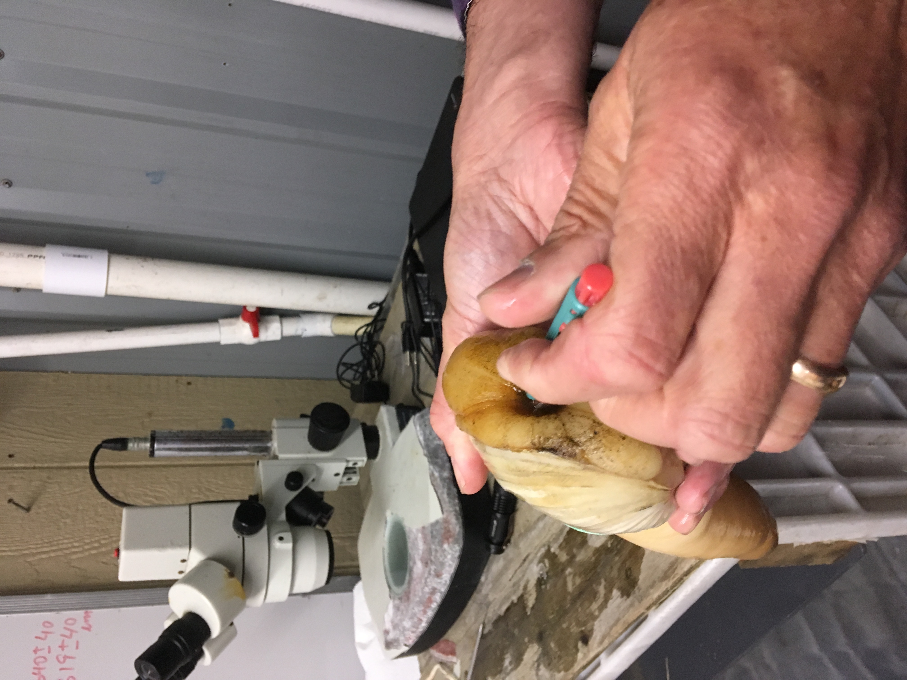

Then, he put that small piece of gonad onto a slide, then added a small amount of seawater.       
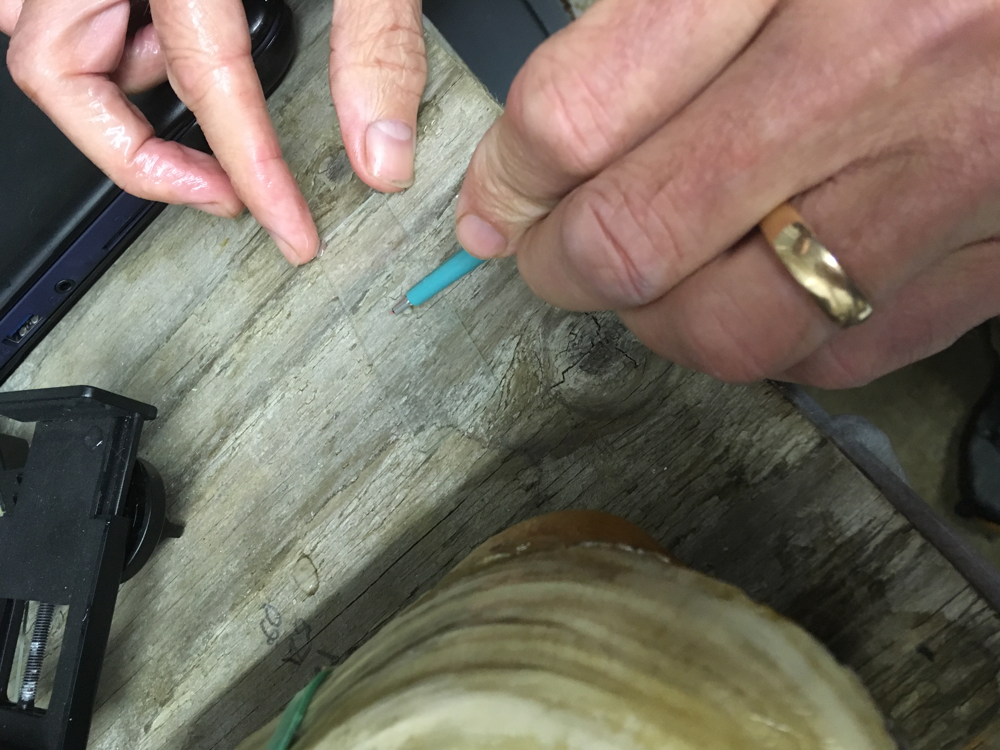    

I looked at the slides under the microscope to look for sperm and eggs. Here are some very obvious females:      
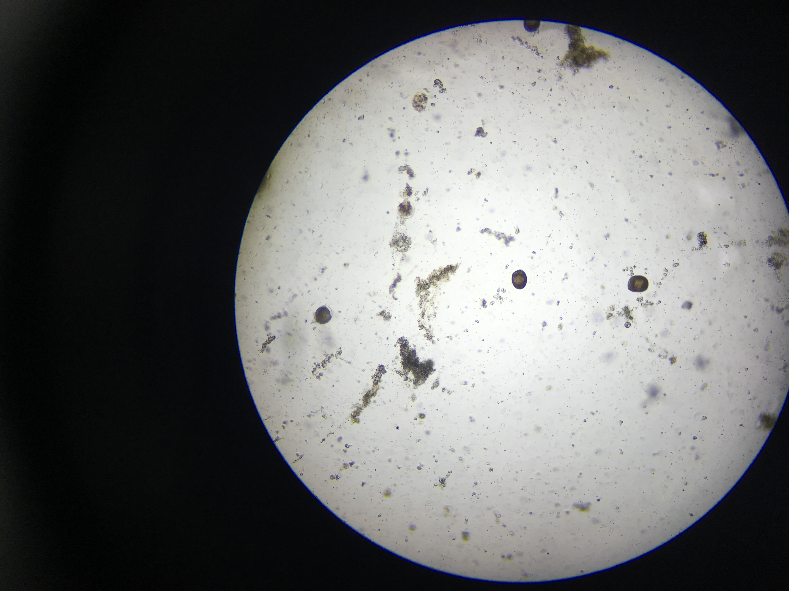        
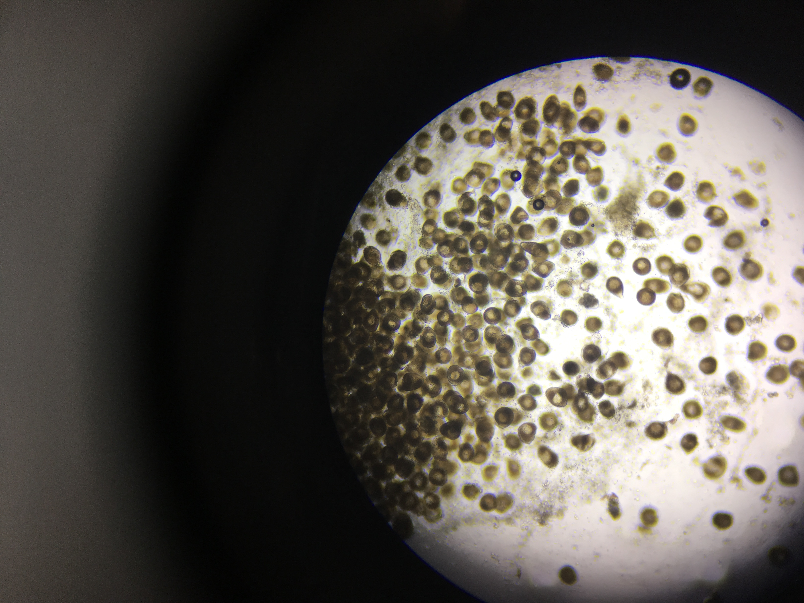    

We identified and saved 4 males and 4 females (green rubberbands) using the biopsy punch method:     
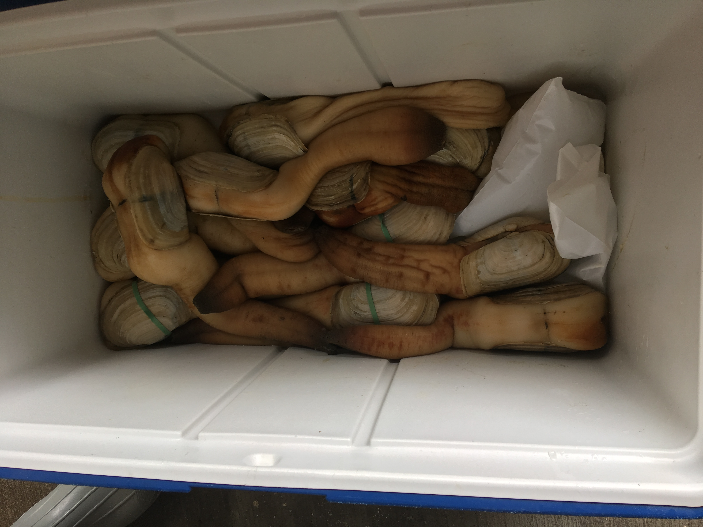    

With our geoduck cooled in the cooler, and materials from Shelly, we headed over to Taylor Shellfish Farm where these geoduck were first created. 

## Today -- Taylor Hatchery:    
We discuessed the plan with Benoit and made adjustments before starting anything. 

We started by delegating tasks: Brent strip spawned three females, and I set up the tripours with their KCl _mM dosages. I'll start with some strips spawning notes, then share how I (with Benoit and Brent's suggestions) set up the dosages in the tripours. 

### Female geoduck strip spawning:     
Brent opened up the females (as determined by the biopsy punches at Pt Whitney)     
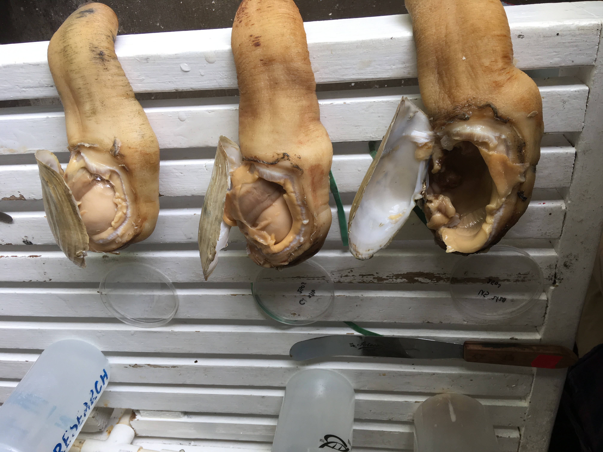     

He then, one at a time, removed the gonad ball/visceral mass and began creating cross-hatches with the razor blade in order to leach out the eggs. Have to be careful not to cut too deep and risk opening up visceral mass and contaminating the eggs with their digestive stuff.     
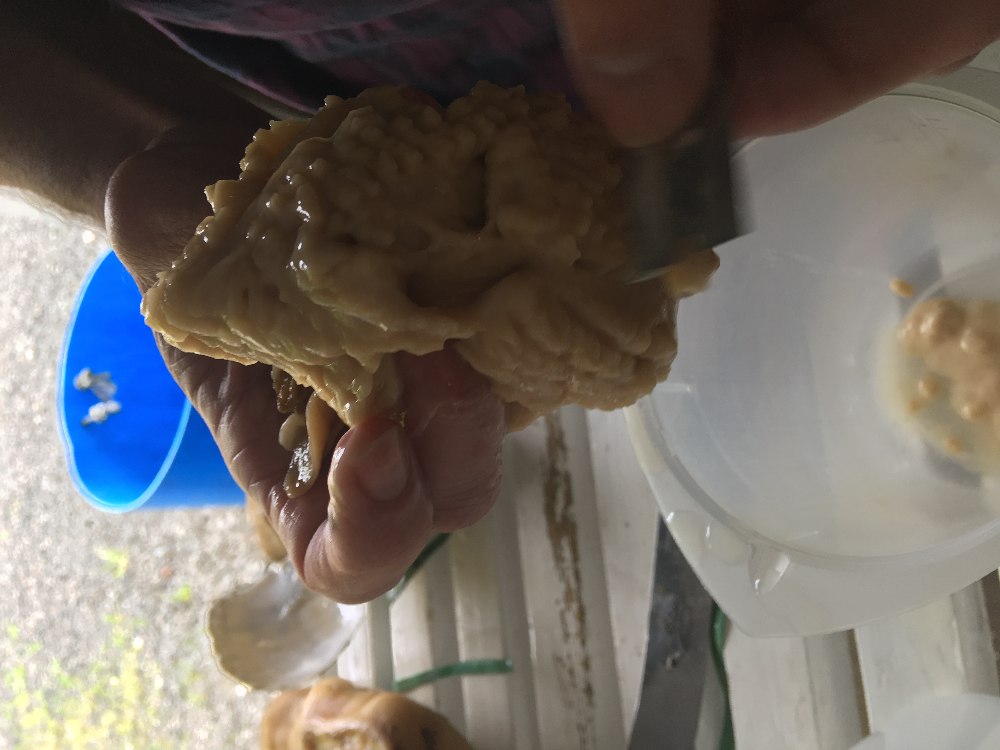    

I didn't get a picture of this, but he used the back of a serated knife to scrape the eggs into the tripour after using the razor blade to create the cross hatches. 

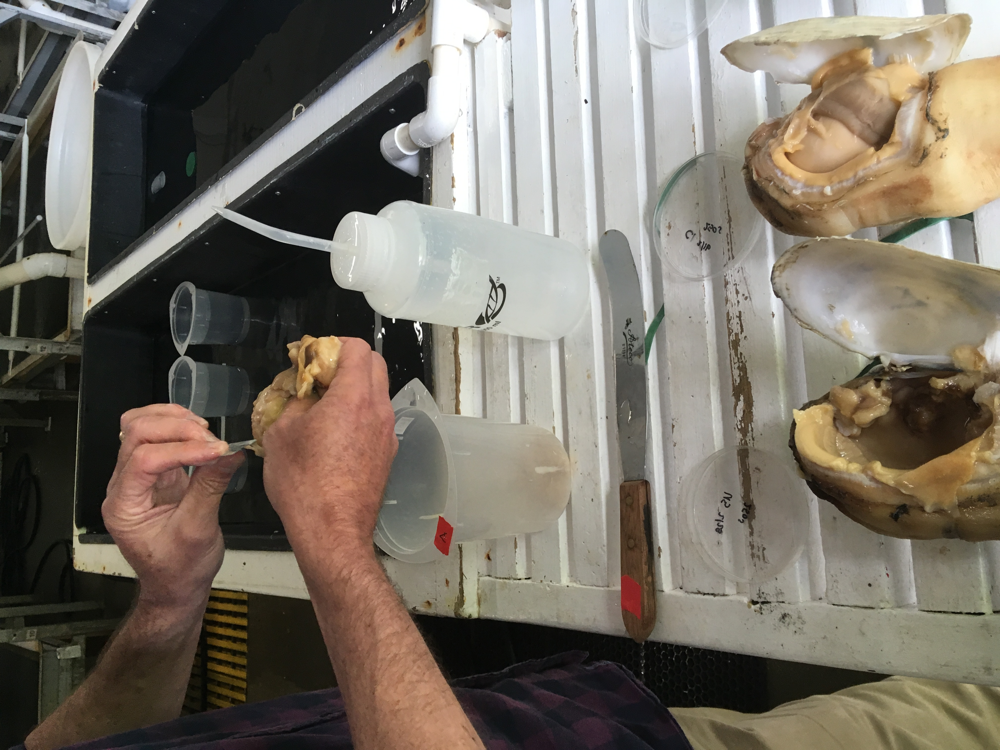   

Next, he rinsed the eggs through a 100µm screen to catch all the tissue chunks and other junk (caught eggs on a 20µm screen). Then he rinsed them back into a tripour for hydrating.     
There were a lot of eggs, so it took some time to drain the 20µm screen:     
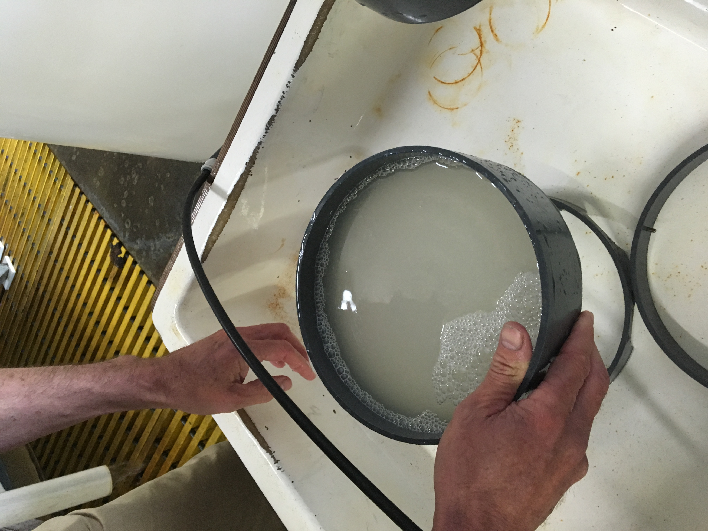     

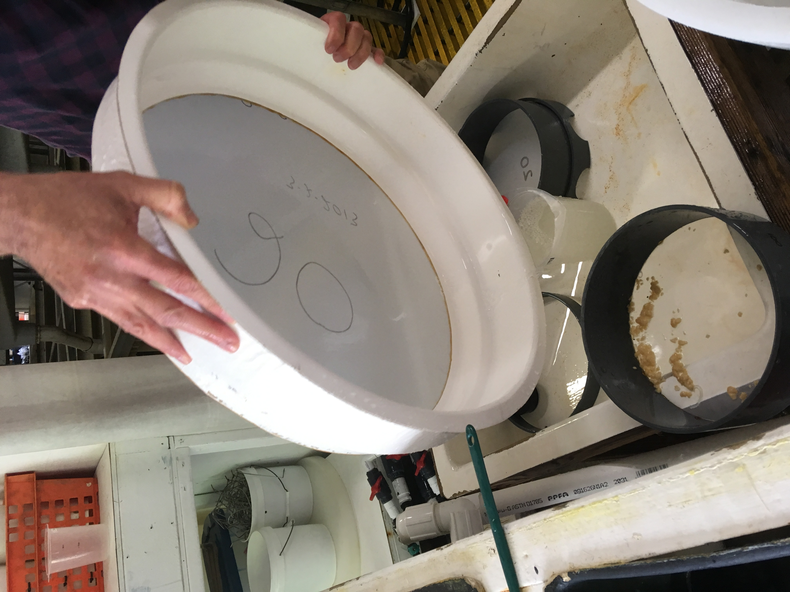   

He then let those hydrate in the seawater for 30 mins before their exposures to the different doses of KCl. 

However, there was one set of triplicates that were not allowed to hydrate. They were dry stripped and Brent put them directly into tripours that I made to be 50mM KCl (~800ml). They sat in the 50mM KCl for 20 minutes. He did not count the eggs - we did this later after we put the eggs back into regular seawater. 

### Creating the different dosages of KCl 
My original calculations in the google doc were for 1L, and also did not take into account the fact that we'd be addng more seawater into the tripours with the eggs (they have to be suspended in some seawater).   

After some math happened, we adjusted everything down to having the end desired volume be ~800ml including the eggs. 

We had 33 tripours, and in each one we wanted to have 10,000 eggs (10 eggs/ml). Total: 330,000 eggs. Additionally, we had a small vial that was 33ml when full, and decided that that would be what we use to add the eggs to each tripour. 

I made the concentrations in large batches, since each one would be separated into triplicates. I made it so that there'd be extra, with end volume of 2.875 L (to be distributed into three tripours ~767ml/tripour).   

| Concentration mM | mL of 2M stock KCl |
|------------------|--------------------|
| 0                | 0                  |
| 10               | 15                 |
| 20               | 30                 |
| 30               | 45                 | 
| 40               | 60                 |
| 50               | 75                 | 
| 60               | 90                 |
| 70               | 105                |
| 80               | 120                | 

I made three sets of the 50mM in triplicate (one triplicate for the instant KCl exposure (blue tape), one triplicate as extras to play around with). I placed them all in the bath that they'll be sitting in for the next couple of days in order to control their temperature. The seawater is at ____ ˚C. 

As soon as Brent had stripped some eggs and didn't hydrate them, he placed some in the 50mM KCl tripours that I labeled with blue tape in order to differentiate from the others:     
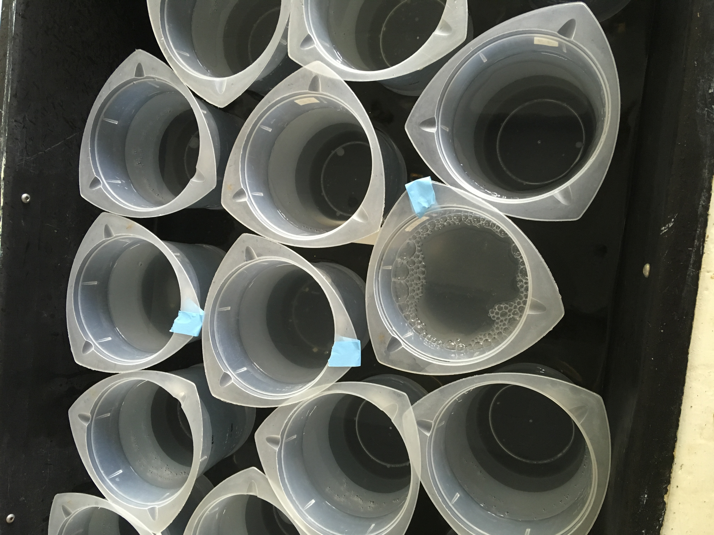    

### Tripour labeling scheme:    
Each tripour has a unique number label and I wrote down what each number corresponds to in my notebook. Here's a table to make it more clear:      

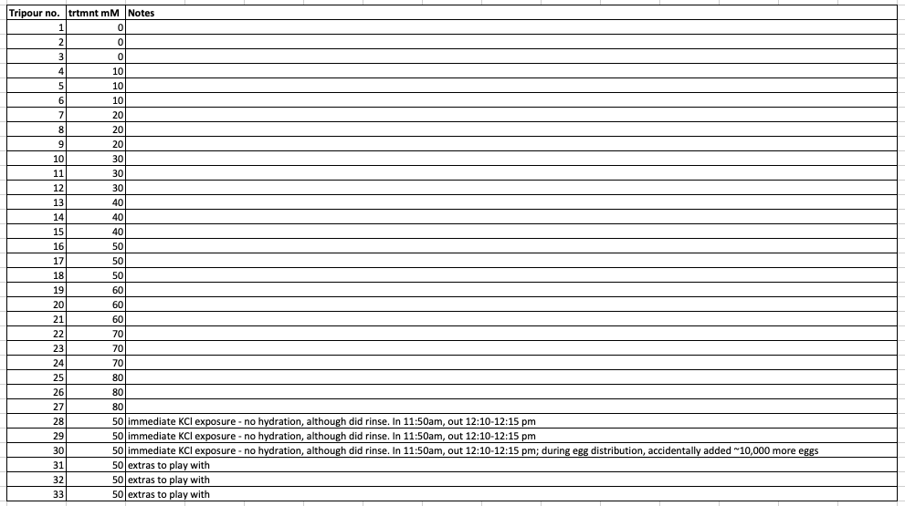    

### Adding eggs to KCl+seawter tripours
Rachel (Taylor Hatchery) counted the eggs using the coulter counter:     
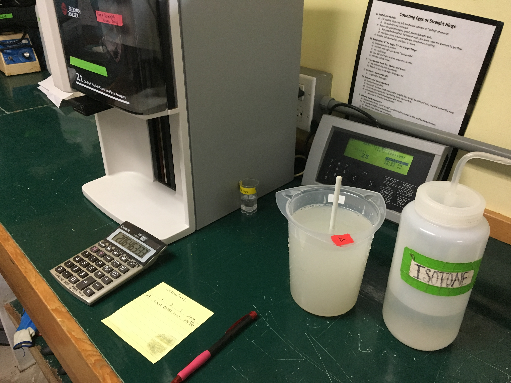

The average of three readings found that there were ~20,646 eggs/ml in a 850ml container (first round of egg stripping). This means that in that tripour, there were about 17.5 million eggs. We figured that we would need to take about 18.5ml of the eggs (mixing well before sampling) and placing them in a new container. Then fill the container up to 1.254L with seawater in order to get a density of ~10,000 eggs/33 ml sampling. 

I placed the 33ml containg ~10,000eggs into each tripour. During this process, I accidentally added an extra 10,000 to tripour # 30 (one of the immediate KCl exposure tripours in which Brent dry stripped some eggs into 50mM KCl+seawater. At the point of adding extra eggs, the original eggs were just sitting in clean saltwater). This wasn't a big deal because we hadn't counted those eggs yet. 

I placed the eggs in the tripours with the different KCl mM amounts from 12:25p - 12:33p. We let them sit for 20 minutes. 

### Rinsing and placing in seawater
After the 20 minutes of KCl exposure, we started to rinse the eggs and placing them in clean saltwater. 

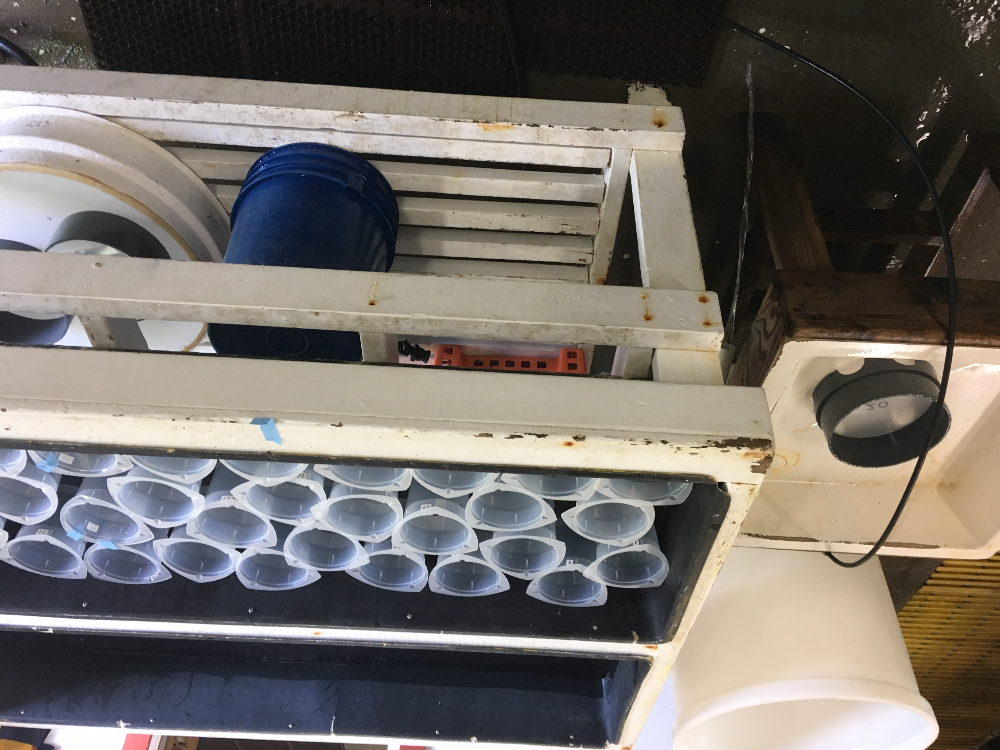

Brent did the rinsing (dumped the eggs into 20µm, rinsed with saltwater, then placed into rinsed-out tripour and filled partially with saltwater), then handed the rinsed eggs to me where I topped them off up to ~800ml saltwater and placed them in the other water table. 

### Stripspawning male geoducks (2)
After all the eggs were placed back into their tripours with saltwater, I started to stripsawn the males (2). All egg tripours were in the water bath, so there shouldn't have been sperm getting into them during this stripping process. 

Opening up the geoduck:       
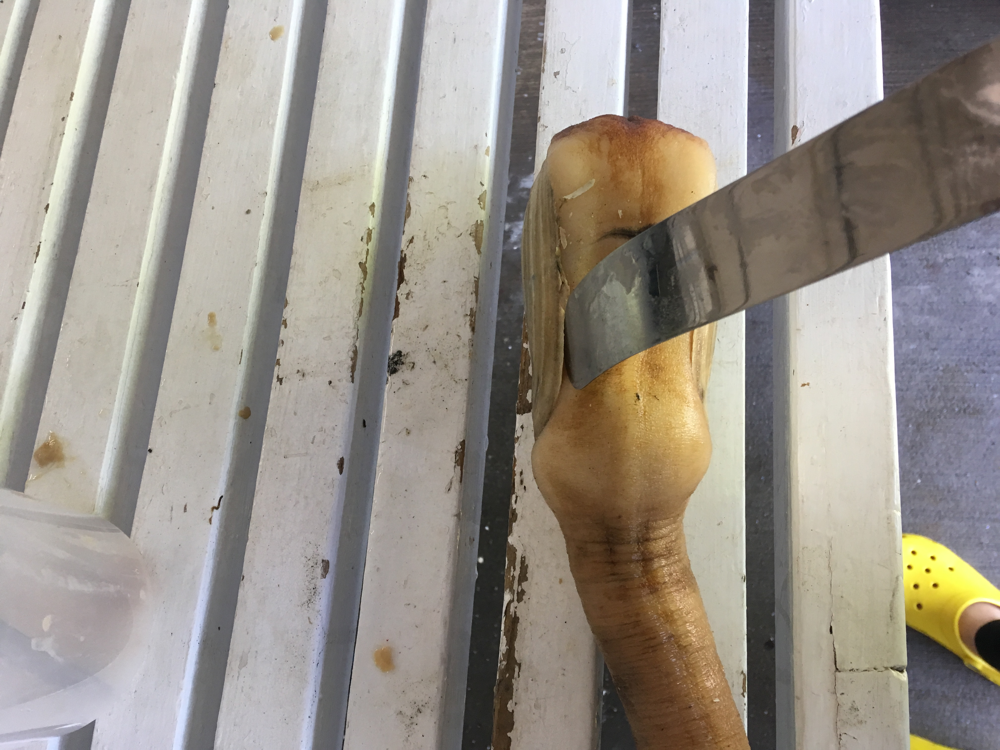

Opened male:     
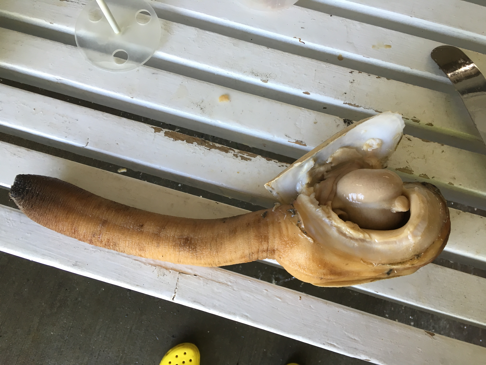

Closeup of the gonad tissue:  
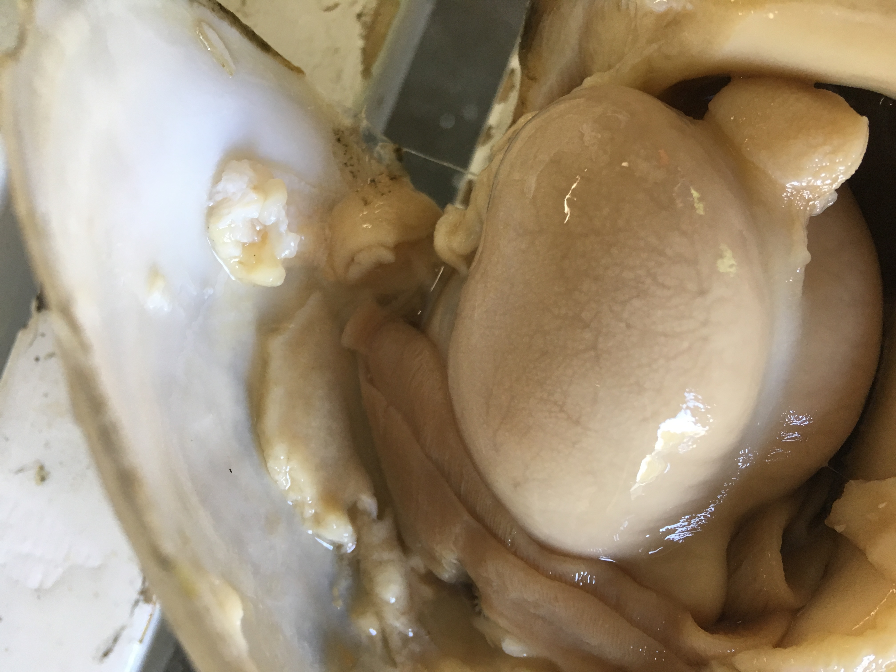

I made cross-hatches using the razor blade in the very top layer of the gonad tissue (the ball of tissue). I made sure not to cut too deep because I want to avoid opening the digestive tissues and contaminating the samples. 

I put the sperm (along with some chunks of gonad tissue that fell in) into a tripour with some clean saltwater:    
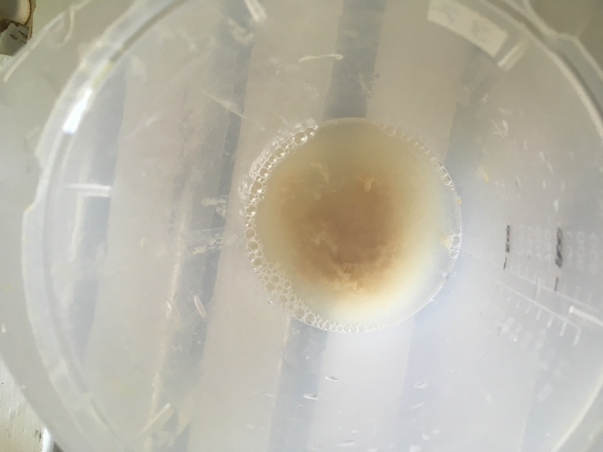

### Using coulter counter to count eggs in the instant-KCl-dose tripours
Benoit used the coulter counter to count the eggs so that we could determine how many milliliters to sample out from each one so that they each had ~10,000 eggs. 

The tripours had a LOT of eggs in them.      
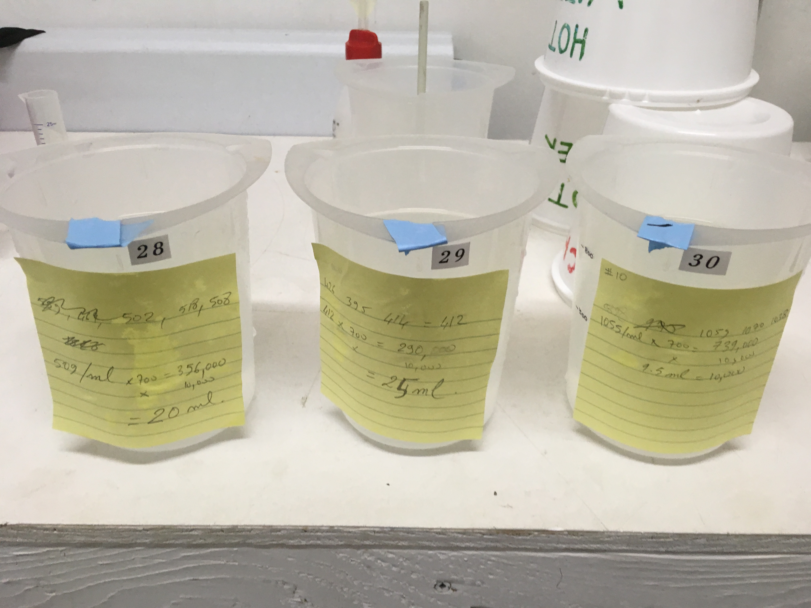

I sampled out the correct amount of milliliters (after plunging to mix) and filled new tripours with seawater and the eggs. The tripours were numbered 38, 39, and 40, but to keep things clearer, I put blue tape over those numbers and wrote "28" "29" and "30" respectively in order to keep the same numbering. 

### Look at some eggs under microscope: polar bodies already???!!!!
Before fertilizing, Benoit and Brent looked at some eggs under the microscope. Some already had polar bodies, which is not something that would happen unless they had been fertilized!

The pink arrow points to a polar body:     
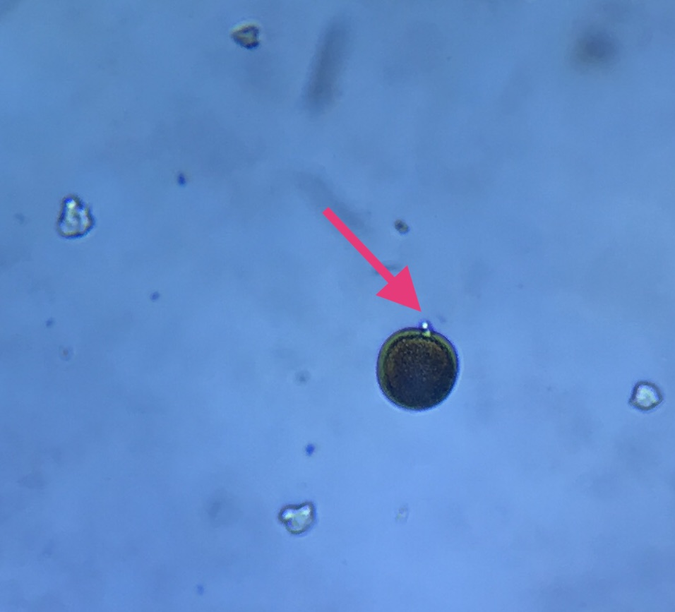

### Thoughts on why the polar bodies may be there
- During the biopsy punching at Pt Whitney, maybe some sperm leaked out and since the geoduck were all held together in one cooler, maybe sperm got on the females. During strip spawning, maybe that sperm found it's way into the egg samples, and thus they were fertilized - resulting in development and polar bodies much quicker than expected

- Hermaphrodites? 

- Does KCl unlock meiosis completely and cause eggs to create polar bodies even without sperm?

This leads us to the idea of investigating this whole thing - maybe there is a time component that we're not thinking about? Maybe there was early sperm contamination when we weren't ready for it? 

### Adding sperm to tripours
Benoit used some of the sperm to fertilize the extra 50mM KCl-dosed eggs (tripours 31-33) in order to determine how much sperm we should use. It ended up being that he just had me start by fertilizing the eggs with ~1ml of the sperm/saltwater, but then saw that that wasn't enough, so had me fertilize with an additional ~2mL of sperm/saltwater.     

I used a plastic pipet to sample out sperm:       
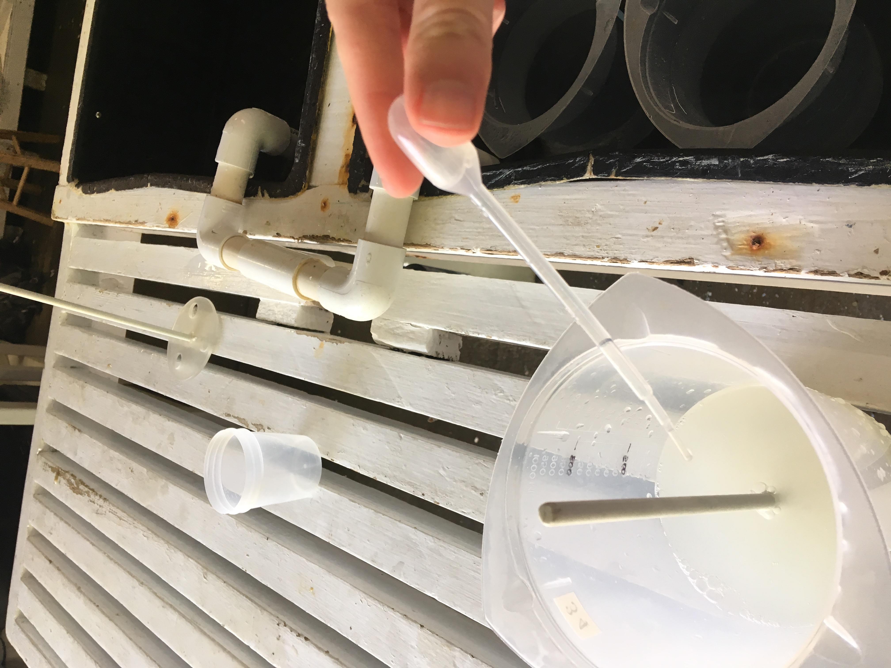

Then plunged to mix in order to fertilize:      
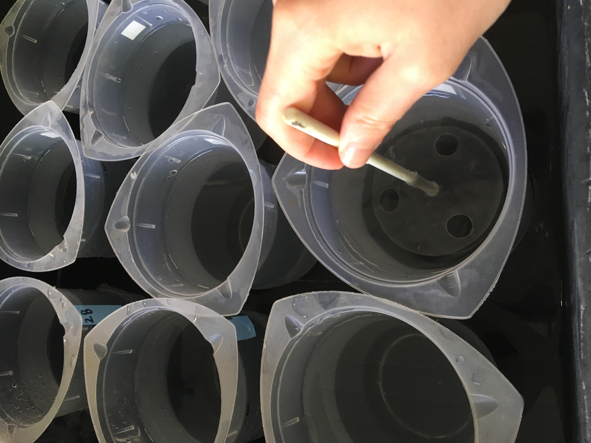

### Next up:   
On Friday, we'll check for D-hinge development. Not sure what we'll find since the whole polar body development was so unecpected. From there, we'll work to determine what we should explore next. 

