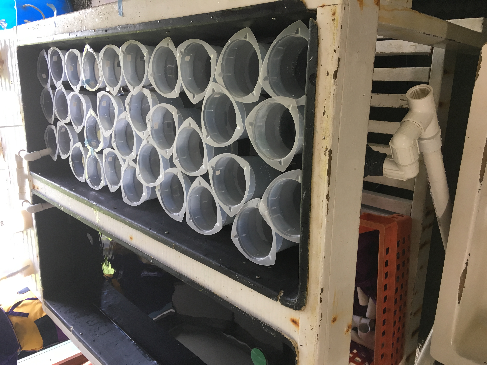

Today was Day 1 of the Geoduck strip spawn experiment at Taylor Shellfish Hatchery. This wil be one of my side projects for my MS program because I realized I really wanted some hands-on, hatchery work experience! Lots and lots and lots of details (and photos) in the post. 

### Prep work done yesterday (Tues, May 28, 2019): 
(Google doc with thoughts, materials, general plan: [here](https://docs.google.com/document/d/1uFnJrJ0XJ8sF5fAu6eht0qSBGD2B3GV2OW1lN5oIN2Q/edit))           
Gathered some material from FTR:
- P1000 pipet (has "Roberts" tape label on it)
- P1000 tips
- Label tape (red and blue)
- Calipers
- CLear plastic small ruler
- Medium gloves
- 10 razor blades
- large cooler 
- squirt bottle

Made 1L of 2M KCl and DI water stock solution:
Dissolved 149.11 g KCl into ~800mL DI water to stir (stir bar)      
Added water up to 1L and placed in 1L glass bottle with lid

I also talked the general plan detailed in the google doc linked above with Brent. 

## Today -- Pt Whitney:
Met Brent and Shelly at Pt Whitney at ~7:30am      
Got some materials from Shelly:   
- 1 full box of biopsy needles
- large metal spatulas (wooden handles) to open geoduck with
- two scalpel handles and a bunch of blades

Brent looked at the geoduck and chose ones that had shells that were squatter (smaller shell length to width ratio = diploid) as those were likely diploid. Did not measure, but chose ones that were clearly not on the cusp of the cutoff of <1.62 ratio length:width. 

He then biopsy punched the gonads by putting the needle into their pedal gape, feeling around for the gonad ball, then biopsy-ing a small piece.      

Then, he put that small piece of gonad onto a slide, then added a small amount of seawater.       
    

I looked at the slides under the microscope to look for sperm and eggs. Here are some very obvious females:      
        
    

We identified and saved 4 males and 4 females (green rubberbands) using the biopsy punch method:     
    

With our geoduck cooled in the cooler, and materials from Shelly, we headed over to Taylor Shellfish Farm where these geoduck were first created. 

## Today -- Taylor Hatchery:    
We discuessed the plan with Benoit and made adjustments before starting anything. 

We started by delegating tasks: Brent strip spawned three females, and I set up the tripours with their KCl _mM dosages. I'll start with some strips spawning notes, then share how I (with Benoit and Brent's suggestions) set up the dosages in the tripours. 

### Female geoduck strip spawning:     
Brent opened up the females (as determined by the biopsy punches at Pt Whitney)     
     

He then, one at a time, removed the gonad ball/visceral mass and began creating cross-hatches with the razor blade in order to leach out the eggs. Have to be careful not to cut too deep and risk opening up visceral mass and contaminating the eggs with their digestive stuff.     
    

I didn't get a picture of this, but he used the back of a serated knife to scrape the eggs into the tripour after using the razor blade to create the cross hatches. 

   

Next, he rinsed the eggs through a 100µm screen to catch all the tissue chunks and other junk (caught eggs on a 20µm screen). Then he rinsed them back into a tripour for hydrating.     
There were a lot of eggs, so it took some time to drain the 20µm screen:     
     

   

He then let those hydrate in the seawater for 30 mins before their exposures to the different doses of KCl. 

However, there was one set of triplicates that were not allowed to hydrate. They were dry stripped and Brent put them directly into tripours that I made to be 50mM KCl (~800ml). They sat in the 50mM KCl for 20 minutes. He did not count the eggs - we did this later after we put the eggs back into regular seawater. 

### Creating the different dosages of KCl 
My original calculations in the google doc were for 1L, and also did not take into account the fact that we'd be addng more seawater into the tripours with the eggs (they have to be suspended in some seawater).   

After some math happened, we adjusted everything down to having the end desired volume be ~800ml including the eggs. 

We had 33 tripours, and in each one we wanted to have 10,000 eggs (10 eggs/ml). Total: 330,000 eggs. Additionally, we had a small vial that was 33ml when full, and decided that that would be what we use to add the eggs to each tripour. 

I made the concentrations in large batches, since each one would be separated into triplicates. I made it so that there'd be extra, with end volume of 2.875 L (to be distributed into three tripours ~767ml/tripour).   

| Concentration mM | mL of 2M stock KCl |
|------------------|--------------------|
| 0                | 0                  |
| 10               | 15                 |
| 20               | 30                 |
| 30               | 45                 | 
| 40               | 60                 |
| 50               | 75                 | 
| 60               | 90                 |
| 70               | 105                |
| 80               | 120                | 

I made three sets of the 50mM in triplicate (one triplicate for the instant KCl exposure (blue tape), one triplicate as extras to play around with). I placed them all in the bath that they'll be sitting in for the next couple of days in order to control their temperature. The seawater is at ____ ˚C. 

As soon as Brent had stripped some eggs and didn't hydrate them, he placed some in the 50mM KCl tripours that I labeled with blue tape in order to differentiate from the others:     
    

### Tripour labeling scheme:    
Each tripour has a unique number label and I wrote down what each number corresponds to in my notebook. Here's a table to make it more clear:      

    

### Adding eggs to KCl+seawter tripours

### Rinsing and placing in seawater

### Stripspawning male geoducks (2)

### Adding sperm to tripours

### Look at some eggs under microscope: polar bodies already???!!!!

### Thoughts on why the polar bodies may be there

