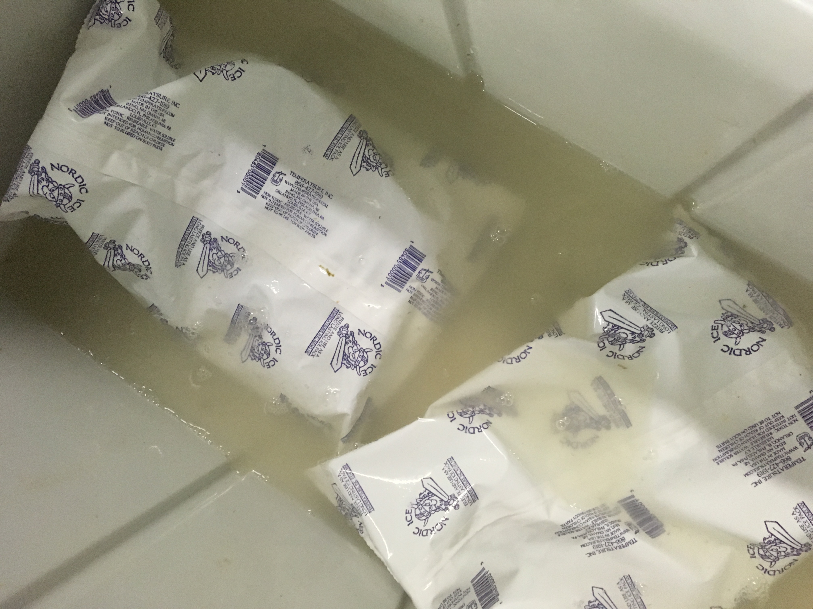
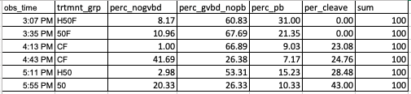

Today I looked into trying to figure out why we saw polar body development as early as we did last week during the first trial of KCl-dosage experiments ([Day1](https://grace-ac.github.io/day1-geo-stripspawn/), [Day2](https://grace-ac.github.io/taylor-stripspawn-day2/)). Details of the experiment are below, but there was egg development in the negative control (no sperm, no KCl), so I'm not sure what this all means. 

### Preparation
*Pt Whitney*    
I got to Pt Whitney around 9:30am (took the 7:55am ferry) and grabbed 28 geoduck (Molly wanted 25 to spawn). I placed them all in the same cooler.

*Taylor*     
I arrived a little after 10am, and started by discussing the plans with Brent and Benoit. Brent helped sort through the geoduck to help find me three diploid, then I sexed them and stopped once I had three ripe females.   

#### New biospy technique that was SUPER easy:     

I used a syringe and this plastic tube that Brent cut the end off of:     

I shoved the plastic tube into the geoduck through the pedal gape, then had a larger opening through the tube end that I could use to poke around with the syringe. I put the syringe into the tissue just barely past the surface of the gonadal mass, then put the fluid on a slide to look for eggs or sperm. 

Benoit noticed that the water in the cooler (in which I brought over all geoduck) looked super milky.     

We realized they likely tried to spawn in the drive over, so it was decided that I would clean the entire experimental area, as well as use a bleach/water solution to clean the geoduck prior to dissection. I also rinsed the gonad/visceral mass once dissected with fresh water just to be extra cautious that no sperm made it's way there. 

I also realized I should have made more stock KCl beforehand, so I just made some at Taylor.     

Water temperature: 16.3C.       

I then set up the tripours that I'd be using, rinsed the 20um screen silos that I'd use to treat the eggs, made sure the area had been rinsed, bleached, and rinsed again, then got started by opening up all three geoduck so that I'd be ready to quickly dry strip eggs from all three directly into the 50mM KCl instant dose treatment tripours. Timed for 20mins.

While the instant dose were sitting, I stripped the rest of the eggs and then screened them with a 90, and caught them on a 20. 

I put them all in one tripour and had them sit in saltwater to hydrate for 30mins. 

Then it was time to take the instant dose eggs out of the 50mM, so I set up two tripours next to them filled with fresh saltwater, then once 20mins was up, I picked up the 20um screen cylinders and placed them into the saltwater (1:30pm).  

After the rest of the eggs were done hydrating, it ended up being 35 mins because I realized I had a few more things to set up. 

I used a plunger to mix the eggs, then scooped about 70-80ml of the egg+saltwater and placed them into each of the four remaining screened cylinders sitting in the tripours (2 control, 2 50mM). 

I let them sit for 20 mins, then removed the 50mM screens and placed them into fresh saltwater tripours (2:15pm).

At this point, it was time to get some sperm, so Molly helped me find some that I could use from their geoduck.       
We started out by placing 2ml of the sperm/saltwater into 1 of each of the treatment tripours (was careful to have the non-fertilized tripours on the other side of the bench, and I wore gloves after fertilization). **Fertilization time: 2:23pm.**      

At 2:50, Benoit took a sample from the control fertilized group and saw that there were about 5/6 eggs with polar bodies at a quick glance, and also noticed there wasn't enough sperm. So at 2:52pm, I added 3ml more to the three tripours. 

Starting at 3:07pm, we started the counts. 

[Count data spreadsheet](https://github.com/grace-ac/Taylor-pano-stripspawn/blob/master/data/060719-pano-egg-development.xlsx) 

At first I was counting up to 200 eggs and repeated three times, but by the time I got to the third group, I decided to count up to 100 eggs three times. I was keeping track of four different things:     

- No gvbd (eggs have a nucleus you can see)
- Gvbd, no polar body (can no longer see nucleus of egg, and it looks like a solid brownish circle)
- Polar bodies (see tiny little clearish greenish circle on the egg - may be 1 or 2)
- Cleaving (2 or more cells)      

I should have probably separated the polar bodies into two groups - one or two polar bodies... but I realized that after I had already gone through three or four treatment groups out of the six... so I just kept going as I had started. 

All counts were finished by 6:15pm.    

### Summary results    

I am not experienced in looking at developing eggs, so my counts are likely not accurate, but were done to the best of my ability. 

I saw some cleaving eggs:     
Some single cleaves at 4:17pm      
     

Some multiple cleaves at 4:46pm      

### Thoughts for next time:   
- Biopsy punch geoduck at Pt Whitney and bring over sexes in SEPARATE containers 

### Before I left, I took a sample of the water in the cooler and looked at it under the microscope:     

