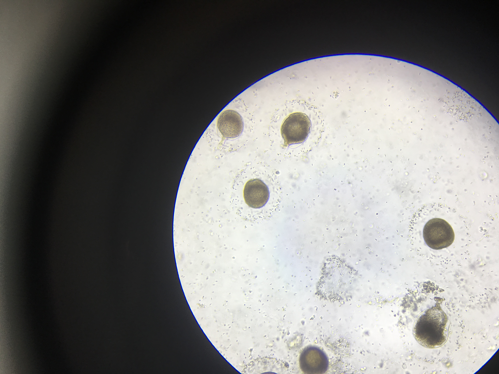
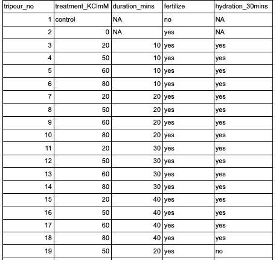
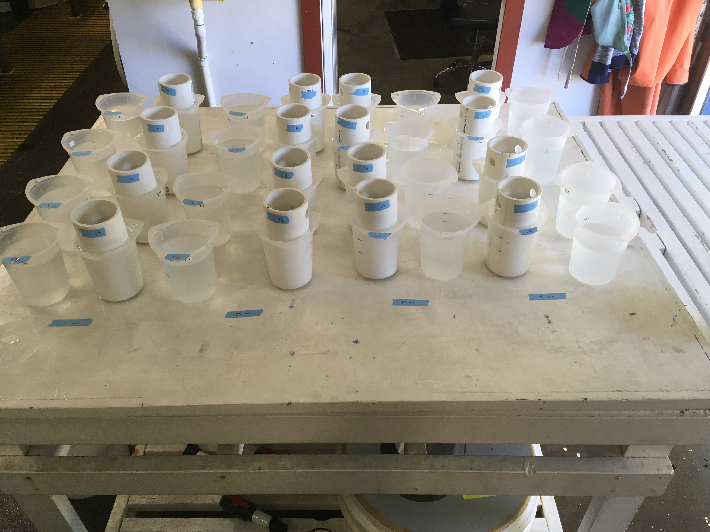
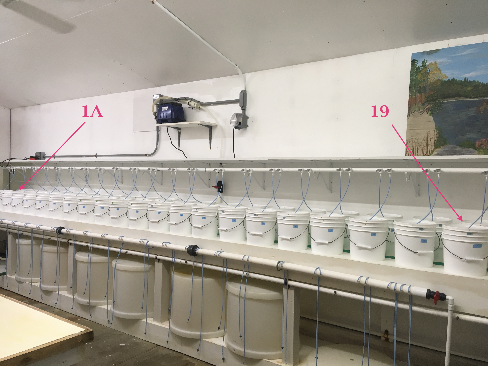

Today was Day 1 of the second trial of geoduck stripspawn. We created an experimental design that takes into account both KCl dosage, and duration of the dose exposure. Overall things went pretty well (details in post), and on Wednesday, I'll check for D-hinge development. 

## [Google doc with plan](https://docs.google.com/document/d/1LFqSM13SukdZ1ehv35L4L_e80DN7SRW33MGhNY6NzKA/edit)     
(written in prep for the day, things changed and will be noted in this post)

## 8:30am - Pt Whitney
Started at Pt Whitney, biopsy punching gonad tissue and checking for sex and ripeness.

I started out getting two or three males, and used a new biopsy punch with each geoduck. I placed the biopsied males in the right tank and grabbed new geoduck to biopsy from the left tank.

I then found two females, and then I found one that looked like a hermaphrodite, which was pretty cool! I've never seen that before:      

Then I kept looking and finally found another female, though it may not have been as ripe as the other two. I left a little after 9:45am. 

## 10:15am - Taylor Hatchery
I started out with cleaning the work area, cleaning the 20 20um screened mini-silos, gathering materials. Benoit, Michelle, and Molly helped by getting a filtered saltwater line available for me to use in the work area. 

Once I had the filtered saltwater, I started setting up the tripours with the different mM KCl dosages, as well as some next to them full of filtered saltwater. While I was doing this, Benoit was setting up buckets in the bucket room with airstones and water in which the fertilized eggs will grow out in at the end of the dosing and fertilizing. 

### Setting up the dosages:    
I filled the tripours up to 800ml (any more than that and the water will spill over once the 20um silo is placed in). When making the dosed saltwater, I made them as though they'd be filled to 1000ml so that the math would be easier. 

I made them in a 3L pitcher, so I did them in sets of two. Example: to make the 20mM, I placed 20mL 2M KCl and 1960ml filtered saltwater. I then dispersed it into two tripours, up to 800ml. I did that again, and then moved on to the next dose. 

| KCl mM | 2 M KCl stock to add (ml) | ml saltwater to add |
|--------|---------------------------|---------------------|
| 20     | 10                        | 980                 |
| 50     | 25                        | 975                 |
| 60     | 30                        | 970                 |
| 80     | 40                        | 960                 |

Tripour treatments:       

### Check female geoduck ploidy
Before dissecting the females and stripping the eggs, I measured the shells:     

| female number | length | width | ratio | diploid? (yes if ratio < 1.62) |
|---------------|--------|-------|-------|--------------------------------|
| 1             | 127    | 73    | 1.739 | no                             |
| 2             | 121    | 71    | 1.704 | no                             |
| 3             | 124    | 80    | 1.55  | yes                            | 

Benoit ran the ctenidia samples from all three females on the flow (? is that what it's called) to check for ploidy. All three had the same ploidy, but it isn't known if they are all three diploid, or all three triploid. Benoit believes they are likely all three diploid. 

### Stripspawn females
I dry stripped some eggs from all three directly into the screened silo sitting in tripour 19 (50mM with no hydration), and timed for 20 mins. **(2:15pm 50mM KCl dose start; put into filtered saltwater tripour at 2:35pm)**

During those 20 mins, I stripped eggs from the three females into some saltwater. Benoit helped get a lot of eggs out. One female was much more ripe than the other two. Of the remaining two, one female was not very ripe at all unfortunately. 

Benoit helped with screening and cleaning the eggs, and counted them using the coulter counter. The first counts showed that there was about 4 million eggs in the 3L pitcher. 

We wanted to have a lot more eggs per treatment, so Benoit stripped some more eggs. 

The second round of counts showed that there were ~15million eggs in the 3L pitcher! It was decided that we would put 600,000 eggs in each mini silo, so I put 120ml in each of the 19 silos.

The silos were sitting in tripours in filtered saltwater. Hydration time was ~30mins. 

### Counting eggs from the dry stripped 50mM silo
At 2:50pm, I screened silo 19 (the dry stripped eggs). I put them into a tripour and suspended them so that Benoit could count the eggs using the coulter counter.          
There were about 307,000 eggs in tripour 19 (50mM KCl instant dose - no hydration). 

I placed them back into the silo into filtered saltwater at 3:05pm. 

### Dosing 
All silos (3-18) started out by sitting in filtered saltwater. 

Then Benoit helped me by moving the silos over to the dosed tripours (we each moved two), and I kept track of time. 

| duration_mins | dose_start | back to FSW time |
|---------------|------------|------------------|
| 40            | 3:14pm     | 3:54pm           |
| 30            | 3:16pm     | 3:46pm           |
| 20            | 3:18pm     | 3:38pm           |
| 10            | 3:20pm     | 3:30pm           | 

The reason why the dose start time are two minutes apart is because it took a long time to drain the FSW out of the 20um screened mini silos, and you have to place them into the dosed tripours very carefully - if you go too fast, the water spills out. 

     
In this picture, the 30 and 40 minute treatments are still sitting in their doses, and then 10 and 20 minute groups are back in FSW after being dosed. 

### Strip spawn male
While we were waiting between moving the dosed eggs back to FSW, Benoit stripped some sperm from two males in the lab room (far away from where all of the eggs are!), and rinsed them with 100um and 20um screens. 

He looked at the sperm under the microscope and saw that they were very active. 

He filled a tripour with sperm/saltwater mix.

### Fertilization
**I kept the negative control tripout (#1) on the bench counter away from where all the eggs that will be fertilized were.**

Benoit said I should fertilize each silo with ~35ml of the sperm/saltwater mix (filled the coulter counter small containers to the top). 

**Fertilization was at 4pm**     
All 18 tripours were fertilized within 1 minute. 

At 4:10pm, Benoit looked at some eggs under the scope from the 10mM 10 minute group and from the 10mM 40minute group and saw that there was some fertilization, and very very few polar bodies... which seemed good for the timeline. 

### Stocking buckets with fertilized eggs for growing out
While we didn't have replicates for dosing, we do have replicates for growing out. 

Silos 1-18 had ~600,000 eggs in them. Silo 19 - the instant 50mM dose one - had 307,000 eggs. 

We decided to have ~300,000 eggs in each bucket, so each treatment group silo's eggs were split in half. Because we don't know if density is important, Benoit and I decided to not have a replicate for silo 19 and just have the one bucket with the ~300,000 eggs. 

#### Stocking
At 4:10pm, I started by stocking the unfertilized negative control silo (silo #1). I used a squirt bottle with saltwaer to rinse the eggs into the tripour, then topped off the saltwater up to 500ml. I then used a plunger to mix the eggs, and poured 250ml of the egg/saltwater into a graduated cylinder. I dumped the eggs in the graduated cylinder and the rest of the eggs left in the tripour into buckets labeled 1A and 1B. 

Because the eggs were fertilized at 4pm, and that Benoit recommended they sit for 15minutes, I started stocking hte rest of the silos around 4:25pm. I let the water in the silo rinse out, then rinsed out the extra sperm that may have been in the tripour, and then used the squirtbottle to rinse the eggs back into the tripour. Topped off up to 500ml, plunged to mix, and dumped 250ml into the A and B buckets for each treatment group number. 

For silo 19, I suspended the fertilized eggs in 250ml, and dumped into bucket labeled 19 (no replicate).

Stocking was finished at 5:37pm. 

37 buckets (1-18 treatment groups in replicate, and treatment group 19). From left to right, group 1 to 19.                 

## Thoughts on this experiment
Benoit and I talked about how this experiment doesn't take into account the timing of fertilization. Should fertilization happen right after dosing with KCl? Should they sit in FSW for a certain amount of time before fertilization? If we could do more trials, we could do a small experiment looking at that variable. 

Additionally, it would have been nice to have had more people so that people could take samples of the eggs throughout different parts of the experiment and take a look at them under the scope. 

Overall, I thought today went pretty well. On Wednesday I'll check for D-hinge development! 
