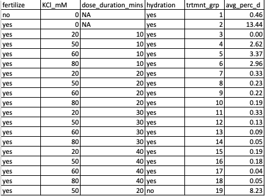

Today I sampled the buckets for D-hinge development. Overall numbers were low, considering that we put 300,000 eggs in each bucket. The best group was treatment group 2: no KCl exposure, but fertilized. Details in post: 

### Procedure: 
Started by checking a few buckets by screening on 20um, and sampling out 1ml from the suspended larvae in ~200ml. Used lugols to stop the larvae from moving around. 

Numbers were very low, but I continued looking anyway and sampled all buckets. 

I screened all buckets on 20um screen, then suspended the eggs using a suirt bottle filled with filtered seawater into a tripour. Then I added enough FSW to reach certain total volumes (detailed in results), then sampled out 1ml after mixing the larvae around. Used a few drops of lugols to stop movement, then counted the number of D-hinge larvae in that 1ml. 

### Results:     
Spreadsheet: [here](https://github.com/grace-ac/Taylor-pano-stripspawn/blob/master/data/061219-d-hinge.xlsx)

The result summary table is showing the treatment groups (KCl dose in mM, duration of dosing, and whether or not the group was hydrated and/or fertilized), and the average percent of development to D-hinge (averaged between the two replicates). 

Note: 19 did not have a replicate. 

### Thoughts on experiment:     
Regarding the low D-hinge counts relative to stocking amount:       
- Maybe there were triploid eggs? Maybe that's why numbers were so low?
- Maybe eggs got burst during the treatment process? When Benoit and I first picked up the screened silos out of the FSW in order to dose the eggs, it took a very long time for the water to drain out through the screen. When we put the screened silos back into the FSW after their respsective dosing durations were finished, it was really fast to drain. Maybe the pressure from the draining water burst the eggs, and that's why numbers were so low? 

Regarding D-hinge in negative control (1):     
- hermaphrodite?
- parthenogensis?
- Could I have possibly mixed up group 1 with group 3? I honestly extremely doubt that because I stocked group 1 (negative control) while all the others were being fertilized on a separate table. 
- Contamination of sperm? possible. I was very cautious and even wore gloves, but there still could have been contamination. 
