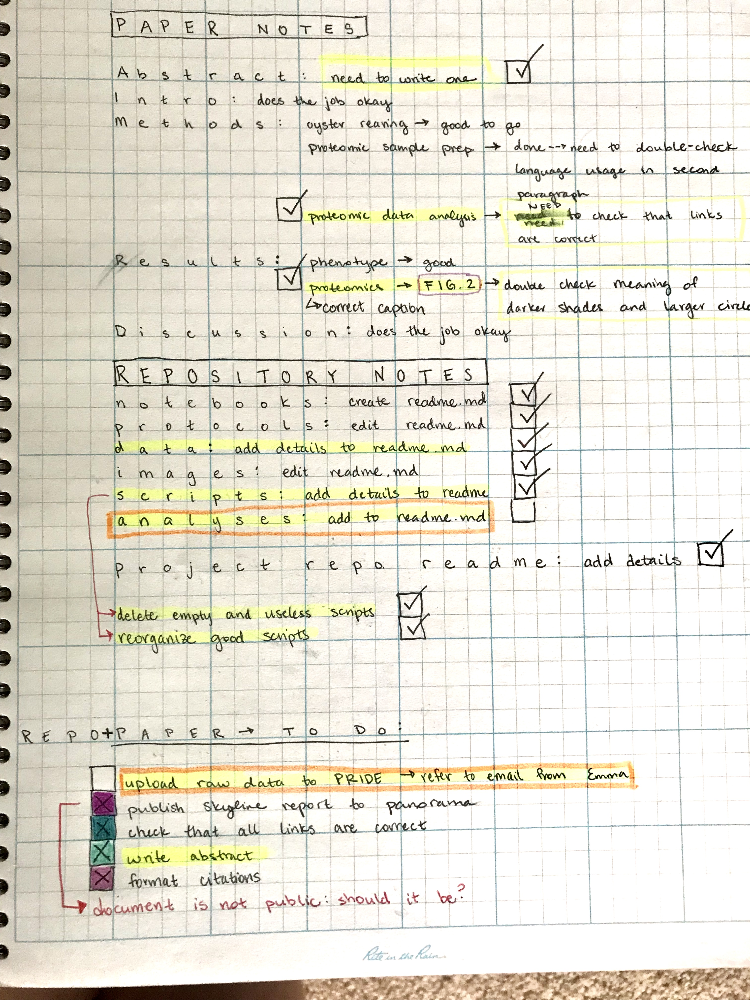

I've been working on finally wrapping up the 2015 Oysterseed DIA project. I feel like I've tied off the paper fairly well this past week, and have been working on cleaning up and organizing the repository today. Details in post. 

### Paper
I've cleaned up some old comments, added some more details in the captions, and double checked all of the links and protocols. 

Google doc: [Oyster-Larval-Proteomics-2015](https://docs.google.com/document/d/1OaYNzlOJr5QibCYt8--GMNGvXlzHPR9_daCkNUVkj-U/edit)

### Respository
I made a repository for the paper during pubathon, and it has turned into a repository for the project as well. The original repository combined both this project and the one that Shelley and Kaitlyn worked on.

Repository: [grace-ac/paper-pacific.oyster-larvae](https://github.com/grace-ac/paper-pacific.oyster-larvae)

I deleted some extra files that were never used for anything related to the final paper, and added information to all of the readme.md files. I still have some tasks to finish up, as noted by my notes (my "to-do" items are boxed in orange):     

