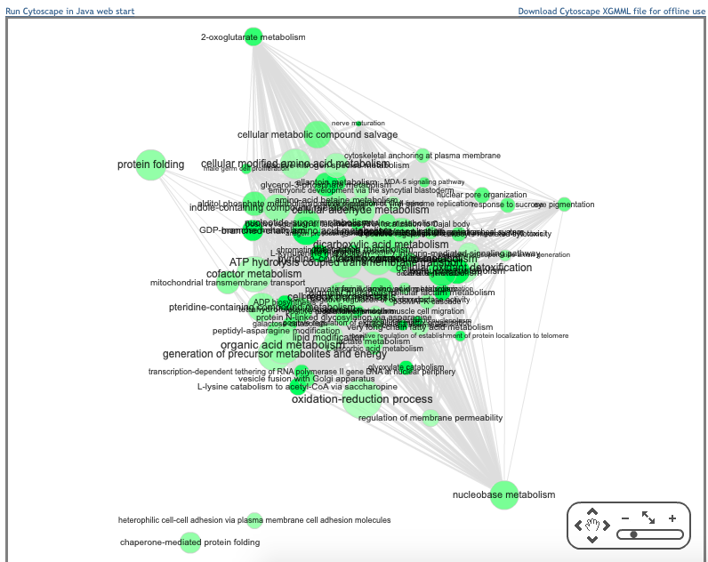
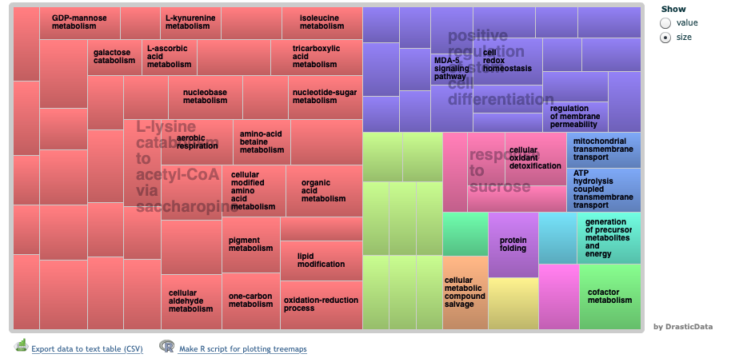

I've been working on finishing up the Oysterseed DIA paper, and met with Steven today to discuss it. Details in post below: 

## Meeting with Steven notes:
He added a lot of helpful comments and suggestions to my paper: [Oyster-Larval-Proteomics-2015](https://docs.google.com/document/d/1OaYNzlOJr5QibCYt8--GMNGvXlzHPR9_daCkNUVkj-U/edit) 

I tried addressing some of the comments this morning and up until we met at 2pm. 

I added 2 tables:     
1. [Enriched GO terms](https://github.com/grace-ac/paper-pacific.oyster-larvae/blob/master/analyses/23C-GOterms-david.tab) (determined by DAVID) from the 33 significantly differentially abundant **23C** proteins
2. [Enriched GO terms](https://github.com/grace-ac/paper-pacific.oyster-larvae/blob/master/analyses/29C-GOterms-david.tab) (determined by DAVID) from the 36 significantly differentially abundant **29C** proteins

I also added an [experimental timeline](https://docs.google.com/drawings/d/1a_07IFVCd8HCAPcZn2pZ0yVXojNvf1XMSfvK6jz8QoA/edit?usp=sharing) that I will edit this weekend after getting feedback from Steven today. 

Other things to do:   
- Methods: remove MS Stats figure part - just have MS Stats in methods as a way to get list of 2808 proteins that were sig. diff. abundant using our set threshold of >2.00 and <-2.00 log-2 fold change
- Results: add more DAVID and REVIGO results using 2808 proteins annotated with Uniprot ([proteins_comp_annot_threshold.csv](https://github.com/grace-ac/paper-pacific.oyster-larvae/blob/master/analyses/proteins_comp_annot_threshold.csv)) as the gene list and the blast results with Uniprot IDs from Steven - blast with [_C. gigas_ proteome](https://raw.githubusercontent.com/grace-ac/paper-pacific.oyster-larvae/master/data/Cg_Giga_cont_prtc_AA.fasta) against uniprot/sprot database ([0327-cgseedblast-sprot.tab](https://raw.githubusercontent.com/grace-ac/paper-pacific.oyster-larvae/master/analyses/0327-cgseedblast-sprot.tab)) (**ADD THIS TO METHODS, TOO**)
- Discussion: make it better (notes for that and outline in [Oyster-Larval-Proteomics-2015](https://docs.google.com/document/d/1OaYNzlOJr5QibCYt8--GMNGvXlzHPR9_daCkNUVkj-U/edit)) 

## Things I did today: 
### Starting to address "Results" for describing sig. diff. abundant proteins relative to proteome

I took the Uniprot IDs (Uniprot ACCESSION) from [proteins_comp_annot_threshold.csv](https://github.com/grace-ac/paper-pacific.oyster-larvae/blob/master/analyses/proteins_comp_annot_threshold.csv) (Uniprot IDs for the 2,808 sig. diff. abundant proteins) and put that into DAVID as the gene list. 

I took the Uniprot IDs (Uniprot ACCESSION) from [0327-cgseedblast-sprot.tab](https://raw.githubusercontent.com/grace-ac/paper-pacific.oyster-larvae/master/analyses/0327-cgseedblast-sprot.tab) (Blast that Steven did with proteome and uniprot database), and put those as the background in DAVID. 

The resulting file came from that: [diffexp-prot-annotated.tab](https://github.com/grace-ac/paper-pacific.oyster-larvae/blob/master/analyses/diffexp-prot-annotated.tab)

It's a huge list. I copy and pasted it into excel to separate out the GO:IDs and the fold enrichment values. 

I input the list of GO IDs and fold enrichment values into REVIGO, and got some visuals, but also got this warning message:     
```
While parsing your data, warning(s) were encountered: 
You have provided a huge list of GO terms, containing 583 terms in the BIOLOGICAL_PROCESS namespace, and only approx. 350 of these terms will be shown in the table below, or be available in the exported text table. REVIGO keeps the terms with the strongest p-values (or enrichements, depending what you had specified on the input form). Consider filtering the list by an external criterion (e.g. enrichment) before submitting to REVIGO.
```

And I got this tip from REVIGO following the warning:      
```
Tip: your resulting list of GO terms seems to be quite long. If you want to reduce it further, press the Back button in your browser and choose a different setting for the "allowed similarity" parameter.
```

I tried using that tip and selected a parameter of 0.5 (the value less than that gave a warning that I could be missing some important GO terms), and still got the same warning and tip messages. 

Here are screenshots of the visuals that REVIGO came up with (using an allowed similarity parameter of 0.5):     
       
          
      
