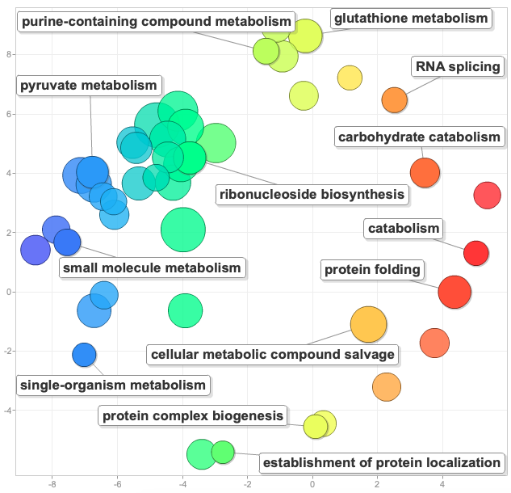
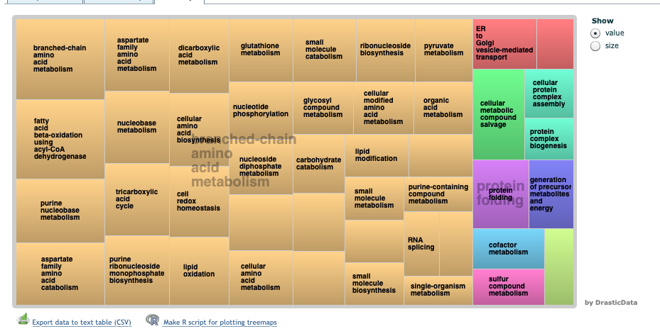

I'm still working on wrapping up the results and discussion of this paper. Steven recommended I look into characterizing the list of detected proteins (2,808) in relation to the whole _C. gigas_ proteome. Detailed in post:    

### DAVID (from [9/27/19 post](https://grace-ac.github.io/oysterseed-new-analyses/))
Gene list: Uniprot accession #s from 2,808 detected proteins --> [Cgseed-protcomp-annotation-name.sorted](https://raw.githubusercontent.com/grace-ac/paper-pacific.oyster-larvae/master/analyses/Cgseed-protcomp-annotation-name.sorted)     
Background: Uniprot accession #s from _C. gigas_ proteome --> [0327-cgseedblast-sprot.tab](https://raw.githubusercontent.com/grace-ac/paper-pacific.oyster-larvae/master/analyses/0327-cgseedblast-sprot.tab)

Resulting file: [david-diffex-proteome.txt](https://raw.githubusercontent.com/grace-ac/paper-pacific.oyster-larvae/master/analyses/david-diffex-proteome.txt)

### Excel to pare down DAVID results:    
Steven recommended only looking at DAVID GO IDs that had <0.05 FDR.    
New list --> 108 GO IDs

### REViGO
I put the 108 GO IDs and their respective fold enrichment values into REViGO (0.7 allowed similarity; numbers associated with GO terms are other than -pvalues, where larger is better) and got the following:    

     

I put them in the [paper](https://docs.google.com/document/d/1OaYNzlOJr5QibCYt8--GMNGvXlzHPR9_daCkNUVkj-U/edit) in the results section and basically said that the most enriched GO processes were to do with general functioning and growth... 

### Paper writing:
I've been woring on clarifying things in the Methods, and working on the discussion. All still very much "work in progress". 
