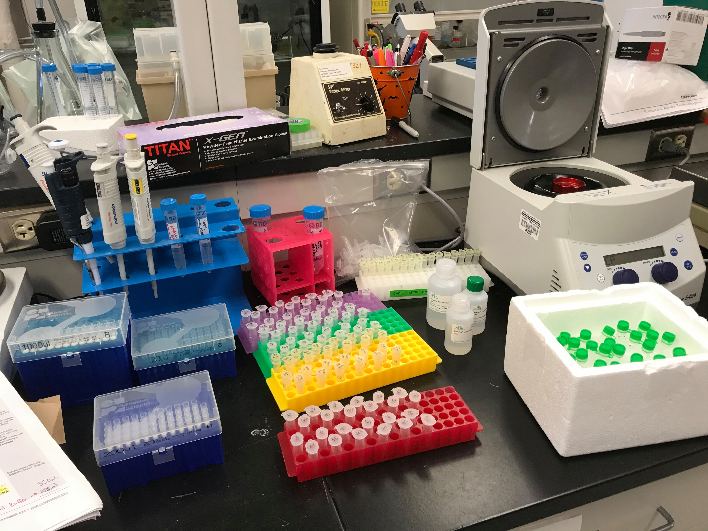
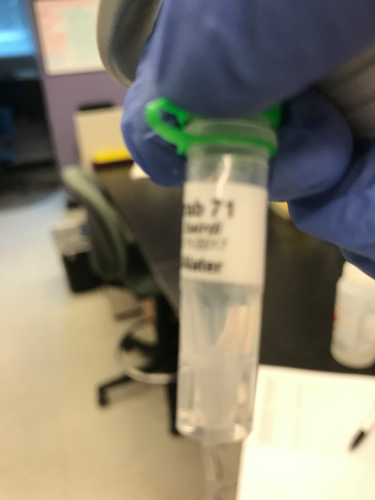
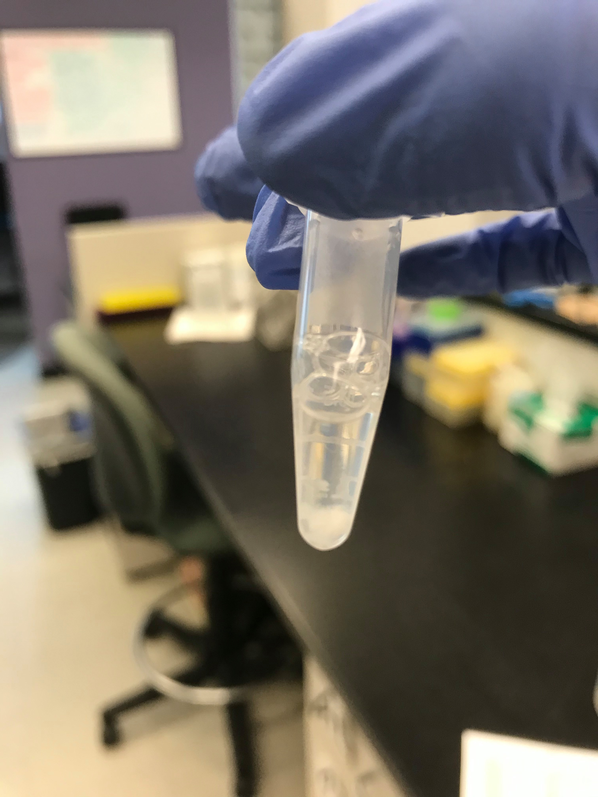

Today I did another round of Day 9 infected (12) and uninfected (12) tanner crab hemolymph RNA extractions. I also ran 2ul of the eluted 15ul RNA on Qubit. Results and details in post. 

### RNA extraction
I followed yesterday's ([post](https://grace-ac.github.io/extract-RNA/)) extraction process as exactly as I personally could. Nothing went wrong as far as I'm aware... 

#### Some notes: 

The following tubes had small amounts of initial pelleted hemolymph:     
71, 67, 177, and 44

The following tubes had white crystal-y stuff in them after sample preparation step:    
20, 54, 24, 169, 29 

After Step 2 (running ethanol through Zymo yellow column), tubes 44 and 29 didn't fully run through, so I ran them through the centrifuge one more time at 10,000 g for 30 sec.

I saved the DNA again, and put with yesterday's saved DNA in FTR 209, -20C on the labeled tube rack. 

### Results
[Raw qubit file](https://github.com/RobertsLab/project-crab/blob/master/data/Qubit_data/QubitData_2019-10-25_17-19-44.csv)   
[Google spreadsheet with tube-numbers](https://docs.google.com/spreadsheets/d/1sB0KzlVfUvodIXCwXpmM7phBDcJu8BMQEMuUMbhkf_Y/edit?usp=sharing)

Just like with yesterday's batch of extracted RNA, I ran 2ul of each sample on Qubit with RNA HS kit. 

#### 23/24 tubes had detectable RNA!!!! WOOOOOO!!!

| qubit_tube_conc_ng.ml | original_sample_conc_ng.ul | sample_vol_ul | dilution_factor | tube_number | extraction_method | ul_sample-used | elution_vol_ul | total-yield_ng |
|-----------------------|----------------------------|---------------|-----------------|-------------|-------------------|----------------|----------------|----------------|
| 258                   | 25.8                       | 2             | 100             | 29          | Zymo_microprep    | 35             | 15             | 335.4          |
| Out of range          | Out of range               | 2             | 100             | 44          | Zymo_microprep    | 35             | 15             | #VALUE!        |
| 130                   | 13                         | 2             | 100             | 1           | Zymo_microprep    | 35             | 15             | 169            |
| 228                   | 22.8                       | 2             | 100             | 177         | Zymo_microprep    | 35             | 15             | 296.4          |
| 115                   | 11.5                       | 2             | 100             | 95          | Zymo_microprep    | 35             | 15             | 149.5          |
| 166                   | 16.6                       | 2             | 100             | 124         | Zymo_microprep    | 35             | 15             | 215.8          |
| 139                   | 13.9                       | 2             | 100             | 67          | Zymo_microprep    | 35             | 15             | 180.7          |
| 118                   | 11.8                       | 2             | 100             | 7           | Zymo_microprep    | 35             | 15             | 153.4          |
| 464                   | 46.4                       | 2             | 100             | 169         | Zymo_microprep    | 35             | 15             | 603.2          |
| 212                   | 21.2                       | 2             | 100             | 24          | Zymo_microprep    | 35             | 15             | 275.6          |
| 117                   | 11.7                       | 2             | 100             | 11          | Zymo_microprep    | 35             | 15             | 152.1          |
| 134                   | 13.4                       | 2             | 100             | 5           | Zymo_microprep    | 35             | 15             | 174.2          |
| 147                   | 14.7                       | 2             | 100             | 166         | Zymo_microprep    | 35             | 15             | 191.1          |
| 174                   | 17.4                       | 2             | 100             | 17          | Zymo_microprep    | 35             | 15             | 226.2          |
| 231                   | 23.1                       | 2             | 100             | 117         | Zymo_microprep    | 35             | 15             | 300.3          |
| 145                   | 14.5                       | 2             | 100             | 102         | Zymo_microprep    | 35             | 15             | 188.5          |
| 186                   | 18.6                       | 2             | 100             | 151         | Zymo_microprep    | 35             | 15             | 241.8          |
| 231                   | 23.1                       | 2             | 100             | 170         | Zymo_microprep    | 35             | 15             | 300.3          |
| 840                   | 84                         | 2             | 100             | 172         | Zymo_microprep    | 35             | 15             | 1092           |
| 186                   | 18.6                       | 2             | 100             | 158         | Zymo_microprep    | 35             | 15             | 241.8          |
| 252                   | 25.2                       | 2             | 100             | 54          | Zymo_microprep    | 35             | 15             | 327.6          |
| 277                   | 27.7                       | 2             | 100             | 20          | Zymo_microprep    | 35             | 15             | 360.1          |
| 100                   | 10                         | 2             | 100             | 63          | Zymo_microprep    | 35             | 15             | 130            |
| 182                   | 18.2                       | 2             | 100             | 71          | Zymo_microprep    | 35             | 15             | 236.6          |

### Samples are in -80 along with the extracted samples from yesterday (Rack 7, column 3, row 4) 
### The remaining pelleted hemolymph are in the same box as yesterday's (Rack 8, column 3, row 5) 

## Next steps:
On Monday, I'd like to run these samples on the bioanalyzer and/or Nanodrop to make sure that things look good. 
