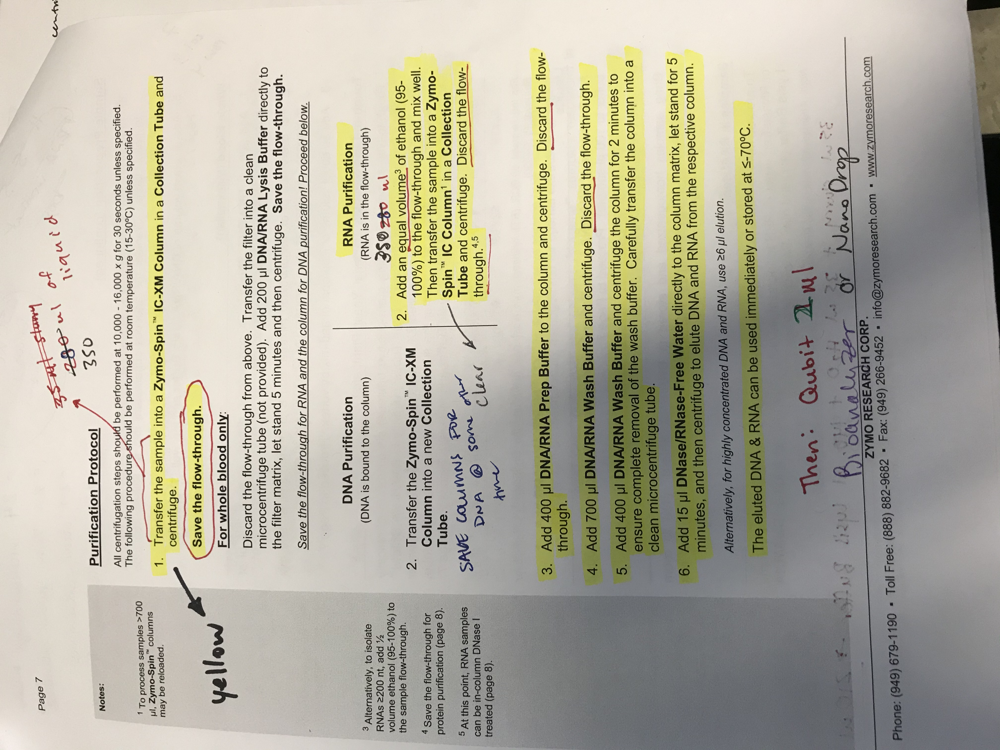

Today, Sam, Steven and I met to discuss a pooling plan for libraries (details in post). From that meeting it was decided that I should extract RNA from more day 12 samples, specfically from cold, warm, and infected and uninfected treatments. All 24 samples had RNA. An updated sample summary is provided at the end of the post. 

### Samples extracted today:    

| FRP  | trtmnt_tank | sample_day | infection_status | maturity | tube_number |
|------|-------------|------------|------------------|----------|-------------|
| 6162 | cold        | 12         | 1                | I        | 220         |
| 6163 | cold        | 12         | 1                | I        | 228         |
| 6164 | cold        | 12         | 1                | I        | 257         |
| 6172 | cold        | 12         | 0                | M        | 316         |
| 6177 | cold        | 12         | 1                | I        | 250         |
| 6178 | cold        | 12         | 0                | M        | 218         |
|      |             |            |                  |          |             |
| 6187 | cold        | 12         | 1                | I        | 239         |
| 6188 | cold        | 12         | 1                | I        | 245         |
| 6189 | cold        | 12         | 0                | I        | 216         |
| 6196 | cold        | 12         | 1                | I        | 203         |
| 6199 | cold        | 12         | 1                | I        | 254         |
| 6231 | warm        | 12         | 1                | I        | 278         |
|      |             |            |                  |          |             |
| 6232 | warm        | 12         | 0                | M        | 286         |
| 6233 | warm        | 12         | 1                | I        | 371         |
| 6234 | warm        | 12         | 0                | I        | 263         |
| 6235 | warm        | 12         | 0                | I        | 297         |
| 6238 | warm        | 12         | 0                | M        | 375         |
| 6245 | warm        | 12         | 1                | I        | 365         |
|      |             |            |                  |          |             |
| 6256 | warm        | 12         | 1                | I        | 283         |
| 6257 | warm        | 12         | 1                | I        | 363         |
| 6261 | warm        | 12         | 1                | I        | 273         |
| 6262 | warm        | 12         | 1                | I        | 289         |
| 6263 | warm        | 12         | 1                | I        | 368         |
| 6266 | warm        | 12         | 1                | I        | 264         |

### Sample preparation and extraction: 
Everything went pretty smoothly, and followed same protocol as last 4 extraction days ([1](https://grace-ac.github.io/extract-RNA/); [2](https://grace-ac.github.io/second-batch-extracted-RNA-and-results/); [3](https://grace-ac.github.io/day12-extractions/); [4](https://grace-ac.github.io/rna-day12-results/)). 

#### Protocol:    

Some notes from today: 
- After Step 1 --> Had to re-spin tube 278 becuase there was still liquid on filter
- After Step 2 --> Had to re-spin tubes 316 and 278 because still liquid on filter
- During Step 3 --> some dried Prep Buffer dust may have gotten into tube 220, 228, 257
- During Step 4 --> Switched to new wash buffer that Sam had added ethanol to on tube 245

### Results: 
- [Raw qubit]()   
- [Google spreadsheet](https://docs.google.com/spreadsheets/d/1Kln27g_Y5tUlxL01XQc6K-wtwY8S3jsOeDqFKJFUZlY/edit?usp=sharing)

| qubit_tube_conc_ng.ml | original_sample_conc_ng.ul | sample_vol_ul | dilution_factor | tube_number | extraction_method | ul_sample-used | elution_vol_ul | total-yield_ng |
|-----------------------|----------------------------|---------------|-----------------|-------------|-------------------|----------------|----------------|----------------|
| 405                   | 40.5                       | 2             | 100             | 264         | Zymo_microprep    | 35             | 15             | 526.5          |
| 166                   | 16.6                       | 2             | 100             | 368         | Zymo_microprep    | 35             | 15             | 215.8          |
| 271                   | 27.1                       | 2             | 100             | 289         | Zymo_microprep    | 35             | 15             | 352.3          |
| 361                   | 36.1                       | 2             | 100             | 273         | Zymo_microprep    | 35             | 15             | 469.3          |
| 207                   | 20.7                       | 2             | 100             | 363         | Zymo_microprep    | 35             | 15             | 269.1          |
| 190                   | 19                         | 2             | 100             | 283         | Zymo_microprep    | 35             | 15             | 247            |
| 370                   | 37                         | 2             | 100             | 365         | Zymo_microprep    | 35             | 15             | 481            |
| 232                   | 23.2                       | 2             | 100             | 375         | Zymo_microprep    | 35             | 15             | 301.6          |
| 409                   | 40.9                       | 2             | 100             | 297         | Zymo_microprep    | 35             | 15             | 531.7          |
| 266                   | 26.6                       | 2             | 100             | 263         | Zymo_microprep    | 35             | 15             | 345.8          |
| 285                   | 28.5                       | 2             | 100             | 371         | Zymo_microprep    | 35             | 15             | 370.5          |
| 510                   | 51                         | 2             | 100             | 286         | Zymo_microprep    | 35             | 15             | 663            |
| 177                   | 17.7                       | 2             | 100             | 278         | Zymo_microprep    | 35             | 15             | 230.1          |
| 284                   | 28.4                       | 2             | 100             | 254         | Zymo_microprep    | 35             | 15             | 369.2          |
| 420                   | 42                         | 2             | 100             | 203         | Zymo_microprep    | 35             | 15             | 546            |
| 444                   | 44.4                       | 2             | 100             | 216         | Zymo_microprep    | 35             | 15             | 577.2          |
| 315                   | 31.5                       | 2             | 100             | 245         | Zymo_microprep    | 35             | 15             | 409.5          |
| 203                   | 20.3                       | 2             | 100             | 239         | Zymo_microprep    | 35             | 15             | 263.9          |
| 125                   | 12.5                       | 2             | 100             | 218         | Zymo_microprep    | 35             | 15             | 162.5          |
| 316                   | 31.6                       | 2             | 100             | 250         | Zymo_microprep    | 35             | 15             | 410.8          |
| 287                   | 28.7                       | 2             | 100             | 316         | Zymo_microprep    | 35             | 15             | 373.1          |
| 272                   | 27.2                       | 2             | 100             | 257         | Zymo_microprep    | 35             | 15             | 353.6          |
| 280                   | 28                         | 2             | 100             | 228         | Zymo_microprep    | 35             | 15             | 364            |
| 129                   | 12.9                       | 2             | 100             | 220         | Zymo_microprep    | 35             | 15             | 167.7          |

### WHere are they now? 
- DNA columns in -20C in FTR 209 in labeled box on top shelf
- Hemolymph pellets are back in their respective positions in the boxes in rack 14
- Extracted RNA eluted in RNase-free water are in [Rack 3, Column 4, Row 2](https://docs.google.com/spreadsheets/d/1Qsvz3QTURlPF_hX05BQxjom3484WuMfqQ1ILl9LEljU/edit#gid=2006985773) in the -80C 

### Sample Summary:  
