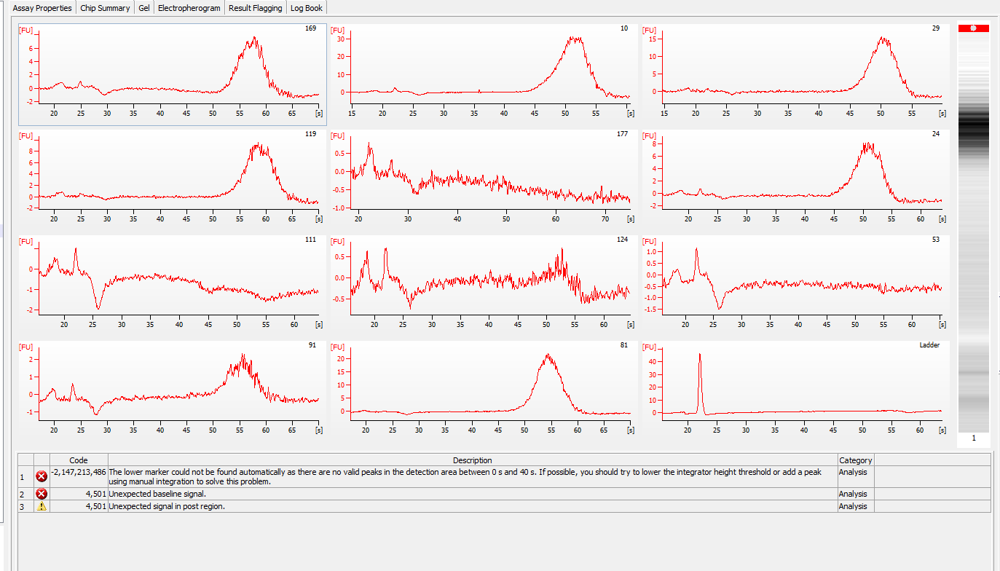

Today I tried doing several things, none of them super successfully. First, I tried using Kallisto to get some quick differential expression results from the new bairdi RNA-seq data. It didn't work, but I just need to look a little more into it. I didn't spend too much time on it. Secondly, I tried running 11 of the extracted RNA samples on the Bioanalyzer - things do not look good. Thirdly, I ran those same samples on the NanoDop. I am not sure what to make of the Nanodop results yet. 

### Kallisto
I made this GitHub Issue after meeting with Steven yesterday: [#790](https://github.com/RobertsLab/resources/issues/790)     

I tried using Kallisto. I downloaded it from here: https://pachterlab.github.io/kallisto/download      
I simply clicked the `Mac` link next to the most resent release date (10/4/2019).     

I then tried using it in a jupyter noteboook: [2019-11-06-bairdi-kallisto.ipynb](https://github.com/RobertsLab/project-crab/blob/master/notebooks/2019-11-06-bairdi-kallisto.ipynb)   

Not entirely sure what there error message means, but I haven't actually spent much time on it yet. Will look into tonight/tomorrow. 

### Bioanalyzer
These are the RNA samples I've chosen to create the 6 pooled transcriptomes:    

| FRP  | trtmnt_tank | sample_day | infection_status | maturity | tube_number | total-yield_ng |
|------|-------------|------------|------------------|----------|-------------|----------------|
| 6157 | NA          | 9          | 0                | M        | 169         | 603.2          |
| 6143 | NA          | 9          | 0                | M        | 10          | 380.9          |
| 6228 | NA          | 9          | 0                | I        | 29          | 335.4          |
| 6150 | NA          | 9          | 0                | M        | 119         | 323.7          |
| 6277 | NA          | 9          | 0                | I        | 177         | 296.4          |
| 6156 | NA          | 9          | 0                | I        | 24          | 275.6          |
| 6272 | NA          | 9          | 0                | I        | 111         | 260            |
| 6178 | NA          | 9          | 0                | M        | 124         | 215.8          |
| 6161 | NA          | 9          | 0                | M        | 53          | 201.5          |
| 6136 | NA          | 9          | 0                | M        | 91          | 192.4          |
| 6137 | NA          | 9          | 1                | I        | 81          | 403            |
|      |             |            |                  |          |             |                |
| 6174 | NA          | 9          | 1                | I        | 20          | 360.1          |
| 6177 | NA          | 9          | 1                | I        | 54          | 327.6          |
| 6122 | NA          | 9          | 1                | I        | 133         | 305.5          |
| 6196 | NA          | 9          | 1                | I        | 170         | 300.3          |
| 6233 | NA          | 9          | 1                | I        | 117         | 300.3          |
| 6187 | NA          | 9          | 1                | I        | 158         | 241.8          |
| 6199 | NA          | 9          | 1                | I        | 151         | 241.8          |
| 6164 | NA          | 9          | 1                | I        | 71          | 236.6          |
| 6237 | NA          | 9          | 1                | I        | 17          | 226.2          |
| 6104 | cold        | 12         | 0                | I        | 259         | 412.1          |
| 6106 | cold        | 12         | 0                | M        | 241         | 169            |
|      |             |            |                  |          |             |                |
| 6153 | cold        | 12         | 0                | M        | 209         | 315.9          |
| 6157 | cold        | 12         | 0                | M        | 224         | 249.6          |
| 6160 | cold        | 12         | 0                | M        | 238         | 494            |
| 6172 | cold        | 12         | 0                | M        | 316         | 373.1          |
| 6175 | cold        | 12         | 0                | I        | 246         | 269.1          |
| 6178 | cold        | 12         | 0                | M        | 218         | 162.5          |
| 6189 | cold        | 12         | 0                | I        | 216         | 577.2          |
| 6191 | cold        | 12         | 0                | I        | 227         | 234            |
| 6196 | cold        | 12         | 1                | I        | 203         | 546            |
| 6128 | cold        | 12         | 1                | I        | 231         | 492.7          |
| 6174 | cold        | 12         | 1                | I        | 233         | 457.6          |
|      |             |            |                  |          |             |                |
| 6148 | cold        | 12         | 1                | I        | 213         | 442            |
| 6173 | cold        | 12         | 1                | I        | 210         | 432.9          |
| 6177 | cold        | 12         | 1                | I        | 250         | 410.8          |
| 6188 | cold        | 12         | 1                | I        | 245         | 409.5          |
| 6199 | cold        | 12         | 1                | I        | 254         | 369.2          |
| 6163 | cold        | 12         | 1                | I        | 228         | 364            |
| 6164 | cold        | 12         | 1                | I        | 257         | 353.6          |
| 6232 | warm        | 12         | 0                | M        | 286         | 663            |
| 6235 | warm        | 12         | 0                | I        | 297         | 531.7          |
| 6253 | warm        | 12         | 0                | I        | 275         | 387.4          |
| 6223 | warm        | 12         | 0                | M        | 270         | 380.9          |
|      |             |            |                  |          |             |                |
| 6228 | warm        | 12         | 0                | I        | 290         | 370.5          |
| 6234 | warm        | 12         | 0                | I        | 263         | 345.8          |
| 6265 | warm        | 12         | 0                | I        | 282         | 317.2          |
| 6238 | warm        | 12         | 0                | M        | 375         | 301.6          |
| 6259 | warm        | 12         | 0                | M        | 281         | 300.3          |
| 6242 | warm        | 12         | 0                | M        | 377         | 289.9          |
| 6255 | warm        | 12         | 1                | I        | 262         | 536.9          |
| 6266 | warm        | 12         | 1                | I        | 264         | 526.5          |
| 6245 | warm        | 12         | 1                | I        | 365         | 481            |
| 6261 | warm        | 12         | 1                | I        | 273         | 469.3          |
| 6249 | warm        | 12         | 1                | I        | 279         | 461.5          |
|      |             |            |                  |          |             |                |
| 6233 | warm        | 12         | 1                | I        | 371         | 370.5          |
| 6244 | warm        | 12         | 1                | I        | 284         | 358.8          |
| 6262 | warm        | 12         | 1                | I        | 289         | 352.3          |
| 6257 | warm        | 12         | 1                | I        | 363         | 269.1          |
| 6256 | warm        | 12         | 1                | I        | 283         | 247            |

#### I started out today by just working with the first 11 samples listed.    

| FRP  | trtmnt_tank | sample_day | infection_status | maturity | tube_number | total-yield_ng |
|------|-------------|------------|------------------|----------|-------------|----------------|
| 6157 | NA          | 9          | 0                | M        | 169         | 603.2          |
| 6143 | NA          | 9          | 0                | M        | 10          | 380.9          |
| 6228 | NA          | 9          | 0                | I        | 29          | 335.4          |
| 6150 | NA          | 9          | 0                | M        | 119         | 323.7          |
| 6277 | NA          | 9          | 0                | I        | 177         | 296.4          |
| 6156 | NA          | 9          | 0                | I        | 24          | 275.6          |
| 6272 | NA          | 9          | 0                | I        | 111         | 260            |
| 6178 | NA          | 9          | 0                | M        | 124         | 215.8          |
| 6161 | NA          | 9          | 0                | M        | 53          | 201.5          |
| 6136 | NA          | 9          | 0                | M        | 91          | 192.4          |
| 6137 | NA          | 9          | 1                | I        | 81          | 403            |

I made a chip all ready to go, but the computer and machine set-up was not great, so Sam helped fix it (connected laptop to monitor becuase laptop screen is too dark since it's low on battery power). 

I ended up losing that chip because it took 10+ minutes to fix the computer-machine situation, and you have to run a chip within 5 minutes. 

#### So, I tried again: 

I ran 1ul of each sample on a RNA Pico Chip. 
Gel:    
  

Electropherogram:      

#### After talking with Sam, he said that I should try running a blank plate to check that all the reagents work, but include the ladder. 

Results from that:     
Gel:     
   

Electropherogram:    

The ladder is not showing up (like it didn't in the previous images with the samples), but the reagents are working correctly. 

#### Then, since I had some gel-dye mixes I made that only last through today, we decided I should give those samples another try, but without the ladder. I don't actually need a ladder for what I'm trying to do. 
Results:    
Gel:      
     
Electropherogram:       

I made a GitHub Issue with these results to get Sam's input: GitHub Issue [#792](https://github.com/RobertsLab/resources/issues/792)    

### Nanodrop
Per Sam's suggestion, I ran those same samples on the Nanodrop (1ul each).    

Results:     

| Sample ID  | User ID       | Date      | Time    | ng/ul      | A260       | A280       | 260/280   | 260/230    | Constant  | Cursor Pos. | Cursor abs. | 340 raw    |           |            |           |            |           |
|------------|---------------|-----------|---------|------------|------------|------------|-----------|------------|-----------|-------------|-------------|------------|-----------|------------|-----------|------------|-----------|
| 10         | Default       | 11/6/2019 | 4:47 PM | 40.03      | 1.001      | 0.486      | 2.06      | 0.32       | 40.00     | 230         | 3.117       | 0.038      |           |            |           |            |           |
| 169        | Default       | 11/6/2019 | 4:48 PM | 51.50      | 1.288      | 0.599      | 2.15      | 1.92       | 40.00     | 230         | 0.671       | 0.020      |           |            |           |            |           |
| 29         | Default       | 11/6/2019 | 4:49 PM | 49.92      | 1.248      | 0.630      | 1.98      | 1.33       | 40.00     | 230         | 0.937       | 0.128      |           |            |           |            |           |
| 119        | Default       | 11/6/2019 | 4:50 PM | 33.50      | 0.838      | 0.486      | 1.72      | 0.22       | 40.00     | 230         | 3.826       | 5.695      |           |            |           |            |           |
| 119        | Default       | 11/6/2019 | 4:52 PM | 7.22       | 0.180      | 0.076      | 2.38      | 0.06       | 40.00     | 230         | 3.049       | -1.480     |           |            |           |            |           |
| 177        | Default       | 11/6/2019 | 4:53 PM | 24.73      | 0.618      | 0.293      | 2.11      | 1.08       | 40.00     | 230         | 0.575       | 0.196      |           |            |           |            |           |
| 24         | Default       | 11/6/2019 | 4:54 PM | 26.51      | 0.663      | 0.319      | 2.08      | 1.13       | 40.00     | 230         | 0.588       | 0.025      |           |            |           |            |           |
| 111        | Default       | 11/6/2019 | 4:55 PM | 23.54      | 0.589      | 0.296      | 1.99      | 0.22       | 40.00     | 230         | 2.637       | 0.138      |           |            |           |            |           |
| 124        | Default       | 11/6/2019 | 4:57 PM | 15.28      | 0.382      | 0.170      | 2.24      | 0.57       | 40.00     | 230         | 0.675       | 0.016      |           |            |           |            |           |
| 53         | Default       | 11/6/2019 | 4:59 PM | 20.58      | 0.514      | 0.272      | 1.89      | 0.10       | 40.00     | 230         | 5.414       | 0.015      |           |            |           |            |           |
| 91         | Default       | 11/6/2019 | 5:00 PM | 15.70      | 0.392      | 0.201      | 1.96      | 0.19       | 40.00     | 230         | 2.022       | 0.621      |           |            |           |            |           |
| 81         | Default       | 11/6/2019 | 5:01 PM | 24.68      | 0.617      | 0.305      | 2.02      | 0.22       | 40.00     | 230         | 2.814       | 0.021      |           |            |           |            |           |
|            |               |           |         |            |            |            |           |            |           |             |             |            |           |            |           |            |           |
| Sample  ID | Curve Type    | Ref  conc | Ref Abs | Std 1 conc | Std 1 Abs. | Std 2 conc | Std 2 Abs | Std 3 conc | Std 3 Abs | Std 4 conc  | Std 4 Abs   | Std 5 conc | Std 5 Abs | Std 6 conc | Std 6 Abs | Std 7 conc | Std 7 Abs |
| 10         | Interpolation |           |         |            |            |            |           |            |           |             |             |            |           |            |           |            |           |
| 169        | Interpolation |           |         |            |            |            |           |            |           |             |             |            |           |            |           |            |           |
| 29         | Interpolation |           |         |            |            |            |           |            |           |             |             |            |           |            |           |            |           |
| 119        | Interpolation |           |         |            |            |            |           |            |           |             |             |            |           |            |           |            |           |
| 119        | Interpolation |           |         |            |            |            |           |            |           |             |             |            |           |            |           |            |           |
| 177        | Interpolation |           |         |            |            |            |           |            |           |             |             |            |           |            |           |            |           |
| 24         | Interpolation |           |         |            |            |            |           |            |           |             |             |            |           |            |           |            |           |
| 111        | Interpolation |           |         |            |            |            |           |            |           |             |             |            |           |            |           |            |           |
| 124        | Interpolation |           |         |            |            |            |           |            |           |             |             |            |           |            |           |            |           |
| 53         | Interpolation |           |         |            |            |            |           |            |           |             |             |            |           |            |           |            |           |
| 91         | Interpolation |           |         |            |            |            |           |            |           |             |             |            |           |            |           |            |           |
| 81         | Interpolation |           |         |            |            |            |           |            |           |             |             |            |           |            |           |            |           | 

I also took screenshots of all the sample graphs: [20191106-notebook-images/nanodrop](https://github.com/grace-ac/grace-ac.github.io/tree/master/notebook-images/20191106-notebook-images/nanodrop)

