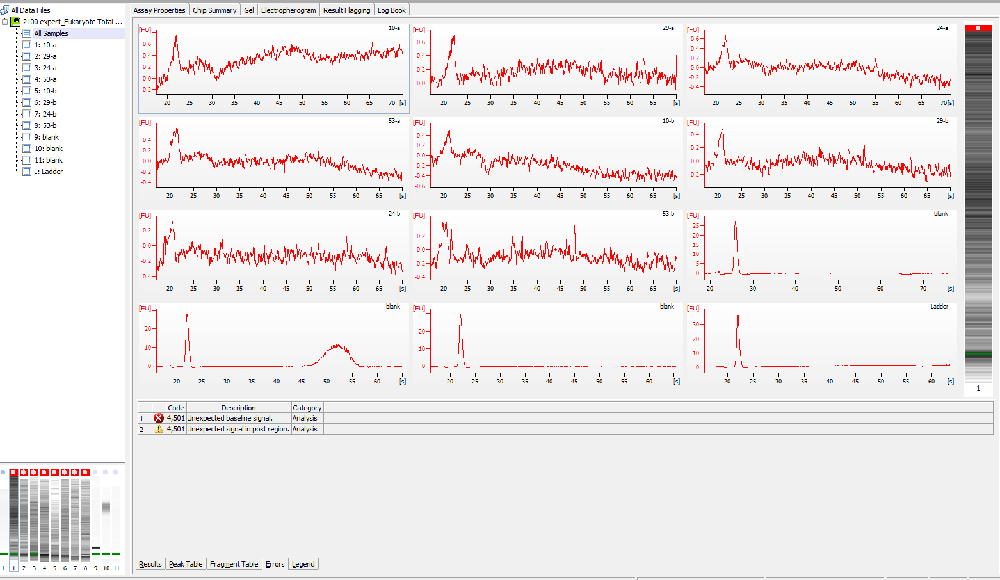
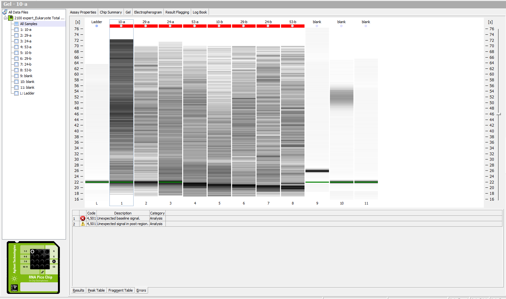

Today I went through the DNase-free plan with 4 of the extracted crab samples. There was initially quite a bit of DNA, then after I used the Turbo DNA-free Kit, there was significantly less DNA. The Bioanalyzer still didn't look super great... detail in post. Also, I'm working through kallisto and have abundance files - working to figure out next steps in order to hopefully create a heatmap of differential expression between the infected and uninfected crabs (combining day 12 and day 26). Details in post. 

## DNA-free plan and results
GitHub Issue: [#792](https://github.com/RobertsLab/resources/issues/792) 

### Plan:        
1. Run four samples from the above group on Qubit using DNA HS
2. Use Turbo DNA-free Kit on those samples
3. Run those samples on Bioanalyzer
4. Re-run those samples on Qubit using DNA HS 

### Results:     
1. Done --> [results](https://docs.google.com/spreadsheets/d/1s24I4mCZ-cc3doEP8mFzSorhmhTRUeOeNhJORagqbpM/edit#gid=0)
2. Done (Did the [routine DNase treatment](https://assets.thermofisher.com/TFS-Assets/LSG/manuals/1907M_turbodnafree_UG.pdf)) 
3. Done (screenshots below) ran each of the 4 samples twice (##-a and ##-b)
4. Done - samples were eluted in ~40-45ul         
(ran dsDNA HS [results](https://docs.google.com/spreadsheets/d/1vo88dZhff06Afgz6ejCYwsYLlOaEO8Z22ui-sg3P58k/edit?usp=sharing); ran RNA HS [results](https://docs.google.com/spreadsheets/d/1jf5JNffUMiI5d7fDz39C7j0v5QXkXBYbwhg7SWC71sY/edit?usp=sharing))

Electropherogram:      
    

Gel:    

### Summary:   
There was a LOT less DNA in the samples after the DNA-free Kit process. However, it resulted in pretty dilute RNA because I had to add enough RNA-free water in the beginning in order to have 50ul of sample for the reagents. Also, the RNA still didn't band very well on the bioanalyzer. I think Steven said we'll just pool them and send them off the NWGC... will confirm next week. 

I'll have to re-extract those 11 samples that I worked with this week on the qubit and bioanalyzer becuase there is not much material left!! Not a big deal. I can do that Monday or Friday (want to have enough time to prepare for GSS talk next Thursday as well). 

## Working for new analyses for GSS: Kallisto
Sam helped me a TON today. 

He helped me set up hummingbird in FTR 213 so that I have my own user account, and that made everything a lot easier. He also helped me get git working from command line so that I can keep all of my work on GitHub in project crab. 

Here's my jupyter notebook: [2019-11-06-bairdi-kallisto.ipynb](https://github.com/RobertsLab/project-crab/blob/master/notebooks/2019-11-06-bairdi-kallisto.ipynb)

There are so many cells because each sample (4 total) has 2 samples for both lanes (4 files total per sample). 

I made individual directories in project-crab/analyses for each sample (number starting with 3#####) and each lane.     
[project-crab/analyses](https://github.com/RobertsLab/project-crab/tree/master/analyses)

Each directory contains three files:     
- abundance.h5      
- abundance.tsv    
- run_info.json

The interesting stuff is in the abundance.tsv files because it has all the count data. 

Next steps are to create a table combining all the count data for all the samples, and then using that in DESeq2 in R to create a heatmap... I think. Still trying to figure that out... 

#### Notes:     
GitHub Issue [#790](https://github.com/RobertsLab/resources/issues/790)        

- Steven's trinity notebook: [006-Trinity.ipynb](https://github.com/sr320/course-fish546-2018/blob/master/jupyter-nbs/006-Trinity.ipynb)
- Steven's DESeq2 notebook: [008-DESeq2.ipynb](https://github.com/sr320/course-fish546-2018/blob/master/jupyter-nbs/008-DESeq2.ipynb)
- My notebook for the trinity stuff (don't think I need to do this because it gives me abundance.tsv files which I already have...?): [2019-11-08-trinity-pl.ipynb](https://github.com/RobertsLab/project-crab/blob/master/notebooks/2019-11-08-trinity-pl.ipynb)
