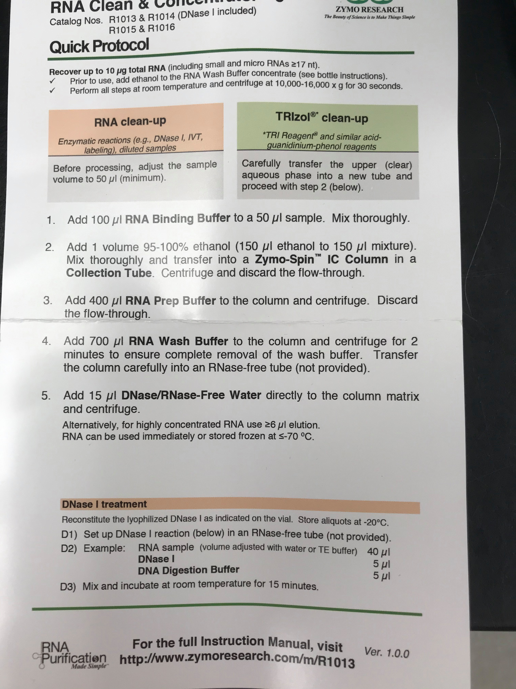

Received the Zymo RNA Clean and Concentrator Kit -5 yesterday. Plan is to concentrate my [6 pooled samples](https://grace-ac.github.io/pooled-6-new-samples/). I tested it out on some test pools I made quickly. Short answer: unclear if it worked because the initial qubit RNA HS readings of the test pools were both "TOO LOW"... and after concentrating, one test pool was still "TOO LOW", while the other was 2.20 ng/ ul in a 2 ul sample from RNA eluted in 35ul. Details in post. (Also at the end of the post: general updates on crab project and my January plans). 

# Creating test pools
### Test Pool 1       

| FRP  | Uniq_ID    | sample_day | infection_status | maturity | tube_number | sample vol remaining | total RNA ng left | ng RNA for pool | vol for pool | total pool conc |
|------|------------|------------|------------------|----------|-------------|----------------------|-------------------|-----------------|--------------|-----------------|
| 6272 | 6272_111_9 | 9          | 0                | I        | 111         | 13                   | 260               | 30              | 1.5          | 120             |
| 6176 | 6176_48_9  | 9          | 0                | M        | 48          | 13                   | 40.3              | 30              | 9.677419355  | 120             |
| 6179 | 6179_34_9  | 9          | 0                | M        | 34          | 13                   | 101.92            | 30              | 3.826530612  | 120             |
| 6205 | 6205_121_9 | 9          | 0                | I        | 121         | 13                   | 80.99             | 30              | 4.81540931   | 120             |

total pool vol ul
12.11767753	

water to add ul
42.88232247

### Test Pool 2        

| FRP  | Uniq_ID    | sample_day | infection_status | maturity | tube_number | sample vol remaining | total RNA ng left | ng RNA for pool | vol for pool | total pool conc |
|------|------------|------------|------------------|----------|-------------|----------------------|-------------------|-----------------|--------------|-----------------|
| 6140 | 6140_8_9   | 9          | 1                | I        | 8           | 13                   | 208               | 30              | 1.875        | 120             |
| 6125 | 6125_144_9 | 9          | 1                | I        | 144         | 13                   | 185.9             | 30              | 2.097902098  | 120             |
| 6137 | 6137_81_9  | 9          | 1                | I        | 81          | 13                   | 403               | 30              | 0.967741935  | 120             |
| 6158 | 6158_101_9 | 9          | 1                | I        | 101         | 13                   | 54.34             | 30              | 7.177033493  | 120             |

total pool vol ul
19.81935928	

water to add ul
35.18064072

## Steps for Pooling

1. Vortex each tube
2. Pool the volume (vol for pool column) into tube
3. Pipet to mix
4. Add enough H20 to get to 55ul (Zymo RNA Clean and Concentrator kit requires samples to be at least 50ul)

# Inital Qubit RNA HS on test pools
Ran 2ul of each pool on qubit using RNA HS Kit. 

Both were "TOO LOW". 

This is becuase I SHOULD NOT have added so much water to the samples... I should have run them on qubit, THEN added enough water to get to at least 50ul sample... 

# Using the kit

Followed protocol. (used 2 of 10 preps)    
Notes:     
Step 2 - used 100% EtOH and centrifuge 10,000g 30 s     
Step 5 - elute 35ul TE (NWGC requires at least 30ul and requires TE)       

# Post-concentration qubit    
Ran 2ul of each 35ul concentrated test pool on qubit using RNA HS Kit.    

Pool 1 --> "TOO LOW"     
Pool 2 --> 2.20 ng in 2 ul (33 ul remaining) --> total RNA concentration remaining: 72.6 ng     

If I pooled the samples well, they each should have had initially ~120 ng of RNA. However, since I added so much H20 before running the pools on the qubit, the RNA concentration was much too low to detect. 

# Summary
This probably works... I'm just a bit nervous to use it on my 6 pooled samples... maybe I'll try again on a 2 new test pools and make sure I run 2ul on qubit before adding so much water for the concentrator kit... 

# Lab meeting notes; Crab project updates; January plan

We did not get the 1 year no-cost extension from NPRB. This means that all grant-related tasks need to be completed by March. 

My priorities for January: 
- Assist Sam with extracting RNA from all samples in freezer (don't have to do all ~250 untouched tubes in freezer, because there are many from Day 26, which is when each crab had 3 samples taken. Will only extract RNA from 1 tube per crab at each time point). 
- Worry about AMSS talk week before conference. If I get new results, great, if not, I have a pretty solid talk from GSS that I can give again. 
- Try to concentrate RNA from my 6 pooled samples and send to NWGC. We need to see how fast they can get them to us. 

