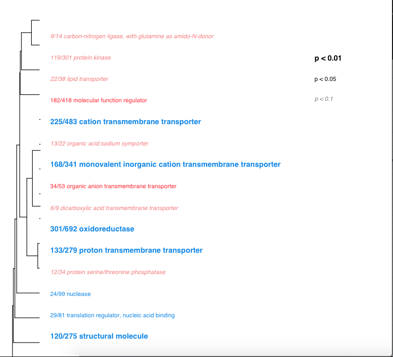

In this post I'll detail what I've been trying in GO-MWU with the 2019 crab dataset, comparing infected and uninfected crabs. The post will detail progress from most recent attempt to frist attempts. 

## GO-MWU resources: 
- [GO-MWU repo](https://github.com/z0on/GO_MWU)       
- [EIMD analyses repo](https://github.com/eimd-2019/project-EWD-transcriptomics/tree/master/analyses) which lists files used for GO-MWU

GO-MWU requires 2 files from your dataset:     
1. "table of GO annotations for your sequences: two-column (gene id - GO terms), tab-delimited, one line per gene, multiple GO terms separated by semicolon. If you have multiple lines per gene, use nrify_GOtable.pl to merge them."       
2. "table of measure of interest for your sequences: two columns of comma-separated values: gene id, continuous measure of significance such as log(fold-change) or -log(p-value). To perform standard GO enrichment analysis based on Fisher's exact test, use binary measure (1 or 0, i.e., either sgnificant or not). To analyze modules derived from WGCNA, specify 0 for genes not included in the module and the kME value (number between 0 and 1, module membership score) for genes included in the module."

Repo in project-crab for GO-MWU --> [here](https://github.com/RobertsLab/project-crab/tree/master/analyses/GO-MWU)

## Latest attempt (afternoon, April 20, 2020)
GO-MWU only works with list of all gene inputs, not just the DEGs.     

Ran GO-MWU script with the following files (which were made in [042020-format-files-for-GO-MWU.Rmd](https://github.com/RobertsLab/project-crab/blob/master/scripts/042020-format-files-for-GO-MWU.Rmd) Rmd:
1. [2019-crab-ALL-geneID-log2fc.csv](https://raw.githubusercontent.com/RobertsLab/project-crab/master/analyses/GO-MWU/2019-crab-ALL-geneID-log2fc.csv) from the list of all 2019 crab genes from `DESeq2` (Steven's script: [here](https://github.com/RobertsLab/project-crab/blob/master/scripts/11-Deseq.Rmd))
2. [crab-GO-annot.tab](https://raw.githubusercontent.com/RobertsLab/project-crab/master/analyses/GO-MWU/crab-GO-annot.tab) from the BLAST output from the full crab transcriptome

GitHub issue to get help figuring out files to use: [#908](https://github.com/RobertsLab/resources/issues/908)

GO-MWU script using those two files: [2019-crab-infection-ALL-GO_MWU.R](https://github.com/RobertsLab/project-crab/blob/master/analyses/GO-MWU/2019-crab-infection-ALL-GO_MWU.R)     
Specified GO-MF (molecular function) because that is what the script from the GO-MWU repo has... just to try it out. 

It worked!! Found 15 GO terms at 10% FDR, so continuing on to plotting was good to go.      
Results: [2019-crab-ALL-GO_MWU-results.csv](https://github.com/RobertsLab/project-crab/blob/master/analyses/GO-MWU/2019-crab-ALL-GO_MWU-results.csv)       
Plot:       
     

Info on plot from [GO-MWU repo](https://github.com/z0on/GO_MWU) 

> The plot consists of three parts:

> Hierarchical clustering tree of significant GO categories based on shared genes in the current dataset. Categories with no branch length between them are subsets of each other and their significance is most likely driven by the same genes.

> Category names, plotted in different colors and fonts. Fonts indicate the level of statistical significance, colors indicate enrichment of GO categories with either up- (red) or down- (blue) regulated genes. The category names are preceded by the fraction indicating the number of "good candidates" relative to the total number of genes belonging to this category. The "good candidates" are the genes exceeding an arbitrary 'absValue' cutoff in their significance measure. Adjust 'absValue' parameter according to what your measure is. By default it is set to -log(0.05,10), assuming that the measure is a signed log p-value (so, the "good candidates" would be the ones with raw p-value < 0.05). Ideally we would like to see more than one such gene per displayed GO category. With 'level1=1' the script will display all the categories containing "good candidates", which is a good way to summarize the whole GO content of the experiment. Note that 'absValue' parameter does not affect statistics and serves just the illustrative purpose. In the Fisher-test mode (binary significance measure) and signed WGCNA module analysis the colors are not used; in that case specify absValue=0.001 to make the script display the fraction of genes with non-zero measure within a GO category.

> The legend giving the correspondence of the fonts to significance thresholds. The method corrects the p-values using Benjamini-Hochberg false discovery rate procedure except when analyzing WGCNA modules; in that case the false discovery rate is determined from ten permutations where significance measures are randomly shuffled among genes. To set different thresholds for plotting, change parameters 'level1', 'level2' and 'level3' in gomwuPlot.

> In addition, the script prints out the number of GO categories displayed and the fraction of "good candidates" that these categories account for. This is useful to evaluate whether the generated GO summary really accounts for a substantial portion of what was going on.

### Next steps:     
**`GO-MWU`**
Try with other tables with measures of interests for 2019 crab data (if interesting) that I made:      
- [2019-crab-ALL-geneID-padj.csv](https://raw.githubusercontent.com/RobertsLab/project-crab/master/analyses/GO-MWU/2019-crab-ALL-geneID-padj.csv) with adjusted pvalue
- [2019-crab-ALL-geneID-pval.csv](https://raw.githubusercontent.com/RobertsLab/project-crab/master/analyses/GO-MWU/2019-crab-ALL-geneID-pval.csv) with p-value

Try GO-MWU modeling off of this EIMD script: [Zostera-GO_MWU.R](https://github.com/eimd-2019/project-EWD-transcriptomics/blob/master/analyses/GO-MWU/Zostera-GO_MWU.R) to specificy different GO categories- BP, CC, MF. 

**Other Options**     
Try DAVID     
Look into potentially using:    
- WGCNA (weighted gene network correlation analysis)??
- GOstats??

## Previous attempts with just DEG list from2019 crab data (incorrect way to use GO-MWU):    
Originally, I tried using GO-MWU with 2 files based on the [DEGlist](https://github.com/RobertsLab/project-crab/blob/master/analyses/2019-infection_DEGlist.tab) that Steven made.           
2 files I used in the above script were made in this script: [041720-DEGlist_annotate-enrich.Rmd](https://github.com/RobertsLab/project-crab/blob/master/scripts/041720-DEGlist_annotate-enrich.Rmd)
1. [019-crab-GO-log2fc.csv](https://raw.githubusercontent.com/RobertsLab/project-crab/master/analyses/GO-MWU/2019-crab-GO-log2fc.csv) based on the DEGlist. 
2. [2019-crab-GO-annot.tab](https://raw.githubusercontent.com/RobertsLab/project-crab/master/analyses/GO-MWU/2019-crab-GO-annot.tab) based on the DEGlist. 

GO-MWU script for just using 2 files based on the DEGlist from SR: [2019-crab-infection-DEGlist-GO_MWU.R](https://github.com/RobertsLab/project-crab/blob/master/analyses/GO-MWU/2019-crab-infection-DEGlist-GO_MWU.R)

Results were that there were 0 GO terms at 10% FDR, so I couldn't continue to plotting. 

Yaamini helped me TON with troubleshooting an error that kept popping up. Had to do with needing to do:     
`quote = FALSE` when writing out the .csv file to use in `GO-MWU`. (GitHub Issue [#907](https://github.com/RobertsLab/resources/issues/907)).
