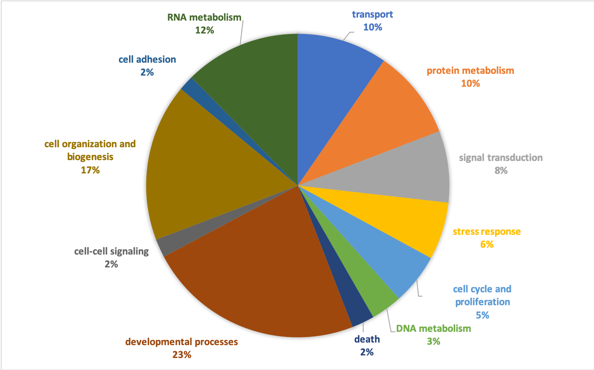
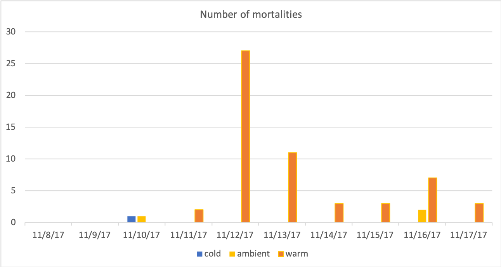

## Crab transcriptome GOslim 
Got the `BLAST` output from the crab transcriptome to GO slim terms using [042320-bairdi_transcriptome-BLAST-to-GOslim.ipynb](https://github.com/RobertsLab/project-crab/blob/master/notebooks/042320-bairdi_transcriptome-BLAST-to-GOslim.ipynb)

Saved this GOslim text file: [GOslim-P-pie.txt](https://github.com/RobertsLab/project-crab/blob/master/analyses/GOslim-P-pie.txt)

GOslim was made in excel because that was easy for me. Removed "other biological processes" and other non-descriptive GOslim terms. 

## Macropinocytosis
Macropinocytosis was identified as the only significantly enriched GO term from the 2019 crab dataset comparing the infected and uninfected crabs. (DAVID output: [analyses/chart_12EFD.txt](https://github.com/RobertsLab/project-crab/blob/master/analyses/chart_12EFD.txt))

I made a list of the 12 genes that comprised the macropinocytosis in [this Rmd](https://github.com/RobertsLab/project-crab/blob/master/scripts/042320-2019crab-genelists.Rmd). The list is [here](https://github.com/RobertsLab/project-crab/blob/master/analyses/macropinocytosis_gene_list.tab). 

The genes were all (except one) described in _Dictyostelium_ (slime mold), which is a protist. _Hematodinium_ is also a protist... interesting. I've added some notes from papers and other things that I've found in the [crab paper](https://docs.google.com/document/d/1xZjT_2ix39jhFGhPjUqjOIubCEZfnl9yDddIjR3nY38/edit#) discussion section. 

## Mortality     
Figure made in excel: [analyses/mort_fig.xlsx](https://github.com/RobertsLab/project-crab/blob/master/analyses/mort_fig.xlsx)           

